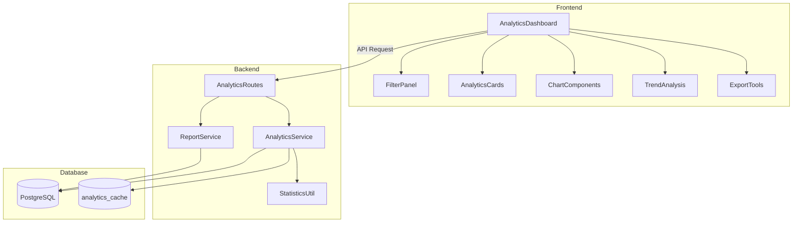
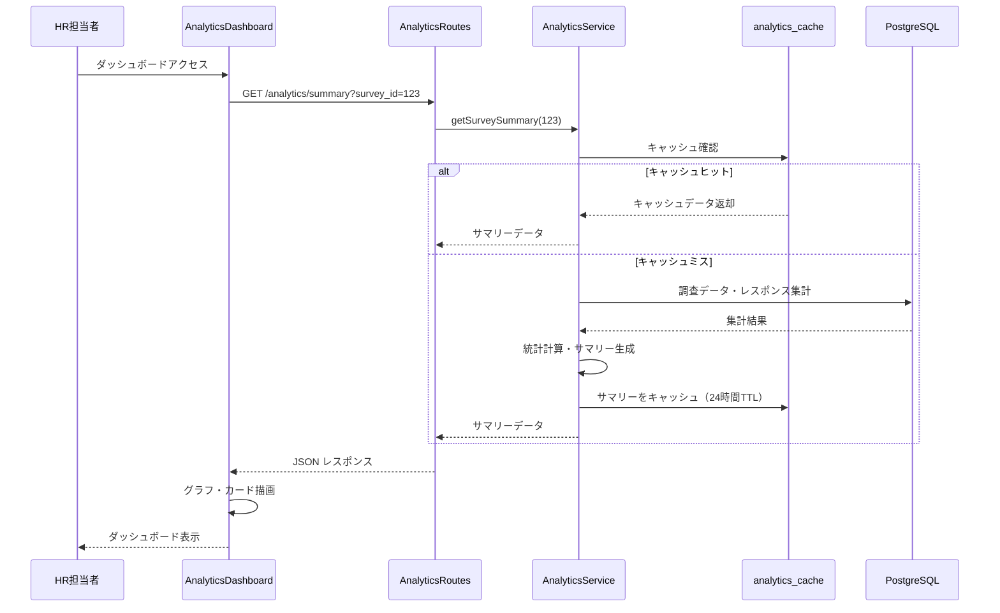
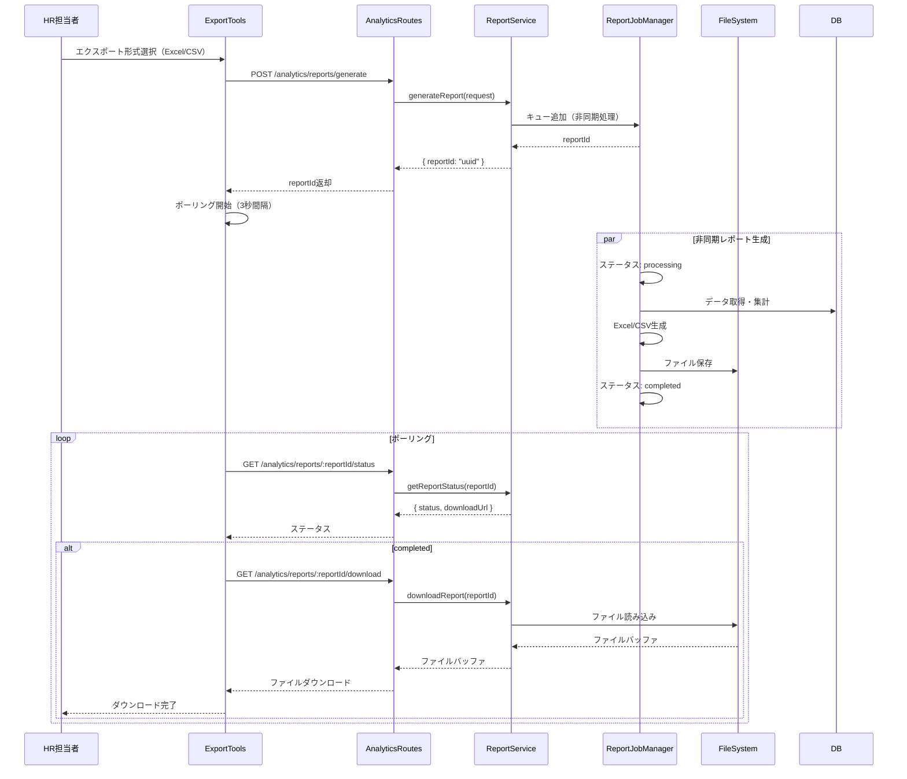
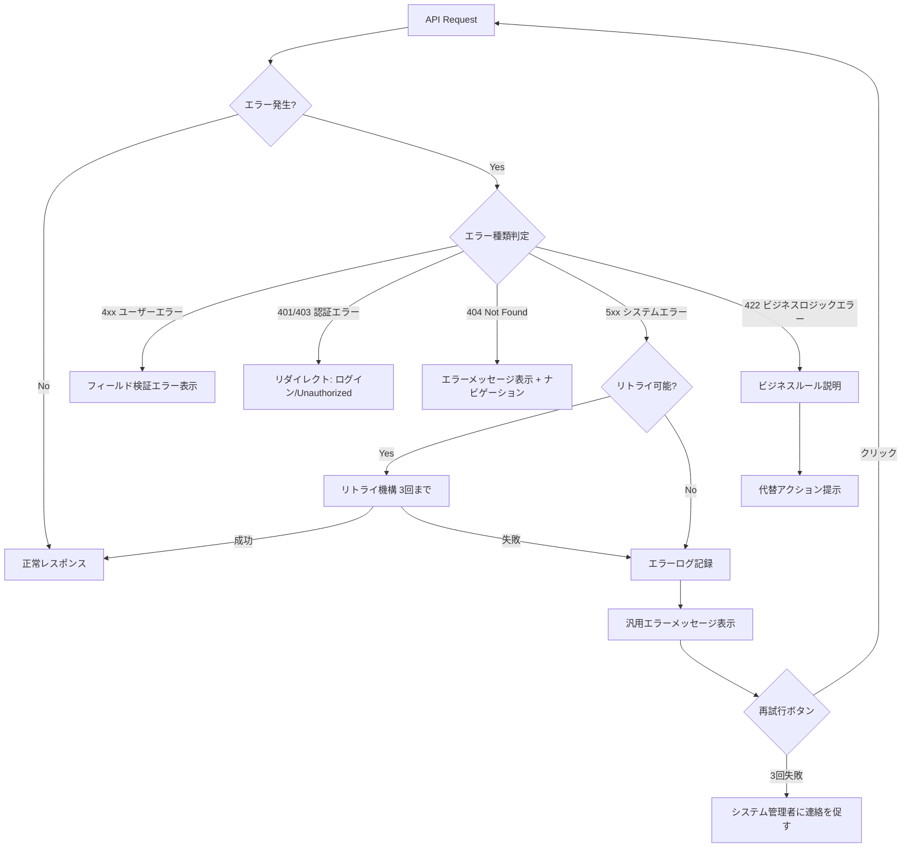

# 技術設計書 (Technical Design Document)

## 概要

分析ダッシュボードは、組織調査の回答データをリアルタイムで集計・分析し、HR担当者がデータ駆動の意思決定を行えるようにする中核機能です。本機能は既存のフロントエンドコンポーネント（`components/analytics/`）とバックエンド分析サービス（`AnalyticsService`）を強化・拡張し、要件定義で規定された10の主要機能領域を実現します。

**目的**: HR担当者が調査結果を視覚的に理解し、カテゴリ別の詳細分析、時系列トレンド、統計情報を通じて組織の状態を把握できるようにする。

**ユーザー**: HR・人事担当者が主要ユーザー。`/admin/analytics`パスでアクセスし、HRRouteガードによってアクセス制御される。

**影響**: 既存の分析コンポーネント（AnalyticsDashboard.tsx等）とバックエンドサービス（AnalyticsService、ReportService）を拡張する形で実装。新規テーブル（`analytics_cache`）の追加により、パフォーマンスとリアルタイム性を向上。

### ゴール

- カテゴリ別分析（A-G）の詳細統計情報表示
- リアルタイムキャッシュ戦略による3秒以内の初回ロード
- レーダーチャート、棒グラフ、折れ線グラフによる直感的可視化
- Excel/CSV形式での柔軟なデータエクスポート
- 5分間隔のデータ更新確認とリアルタイム反映

### 非ゴール

- AIによる自由記述回答分析（将来拡張）
- クロス集計機能（将来拡張）
- アラート機能（将来拡張）
- モバイルアプリ対応（タブレット以上のレスポンシブデザインのみ）

## アーキテクチャ

### 既存アーキテクチャの分析

本プロジェクトは**レイヤードアーキテクチャ**を採用しており、以下の層で構成されています：

- **フロントエンド層**: React + TypeScript + Vite、Zustandによる状態管理、React Queryによるサーバー状態管理
- **バックエンド層**: Fastify + TypeScript、レイヤードアーキテクチャ（Routes → Services → Repositories → Database）
- **データベース層**: PostgreSQL 15、カスタム接続プール実装

**既存の分析機能**:
- `AnalyticsService`: 調査サマリー、カテゴリ分析、トレンド分析の基本実装
- `ReportService`: レポート生成とジョブ管理
- `StatisticsUtil`: 基本統計量計算、トレンド分析ユーティリティ
- フロントエンドコンポーネント: AnalyticsDashboard、AnalyticsCards、ChartComponents、FilterPanel、ExportTools、TrendAnalysis

**統合ポイント**:
- `/api/analytics/*` エンドポイント: 既存のREST APIを拡張
- `analytics_cache`テーブル: 新規追加によるキャッシュ戦略
- React Queryのキャッシュ機構: サーバー状態管理と連携

### 高レベルアーキテクチャ



### アーキテクチャ統合

**既存パターンの保持**:
- レイヤードアーキテクチャの遵守（Routes → Services → Repositories → Database）
- Zodによるスキーマバリデーション
- Fastifyプラグインシステムによるルート定義
- React Queryによるサーバー状態管理
- Rechartsライブラリによるグラフ可視化

**新規コンポーネントの妥当性**:
- `analytics_cache`テーブル: パフォーマンス要件（3秒以内のロード）を満たすために必須
- キャッシュ無効化ロジック: リアルタイム性とパフォーマンスのバランス
- バックグラウンド更新確認: 5分間隔のポーリングによる最新データ反映

**技術スタックの整合性**:
- TypeScript strict mode（既存の型安全性基準に準拠）
- Recharts 2.10.3（既存のグラフライブラリ）
- Zustand 5.0.8（グローバル状態管理）
- React Query 3.39.3（サーバー状態とキャッシュ）

**ステアリング準拠**:
- 関心の分離: UIロジックとビジネスロジックの分離維持
- 依存性逆転: サービス層がリポジトリインターフェースに依存
- 単一責任: 各コンポーネント・サービスが1つの責務のみ担当
- 型安全性: TypeScript strict mode、Zodランタイムバリデーション

## システムフロー

### 調査サマリー取得フロー



### データエクスポートフロー



## 要件トレーサビリティ

| 要件 | 要件概要 | 実現コンポーネント | インターフェース | フロー |
|------|----------|-------------------|-----------------|--------|
| 1.1-1.5 | 調査サマリー表示 | AnalyticsService, AnalyticsDashboard | GET /analytics/summary | 調査サマリー取得フロー |
| 2.1-2.5 | カテゴリ別分析 | AnalyticsService, CategoryAnalysisCard | GET /analytics/categories | カテゴリ分析取得フロー |
| 3.1-3.6 | グラフ可視化 | ChartComponents (Recharts) | Props Interface | レンダリングフロー |
| 4.1-4.6 | トレンド分析 | AnalyticsService, TrendAnalysis | GET /analytics/trends | トレンド分析取得フロー |
| 5.1-5.5 | フィルタリング機能 | FilterPanel, Zustand Store | State Management | フィルタ適用フロー |
| 6.1-6.6 | データエクスポート | ReportService, ExportTools | POST /analytics/reports/generate | データエクスポートフロー |
| 7.1-7.5 | リアルタイム更新 | PollingHook, Cache Invalidation | キャッシュ無効化API | 更新確認フロー |
| 8.1-8.5 | パフォーマンス要件 | analytics_cache, ConnectionPool | キャッシュ戦略 | キャッシュフロー |
| 9.1-9.5 | エラーハンドリング | ErrorBoundary, ErrorHandler Middleware | エラーレスポンス | エラーハンドリングフロー |
| 10.1-10.5 | アクセス制御 | HRRoute, AuthContext | ルートガード | 認証・認可フロー |

## コンポーネント設計とインターフェース

### フロントエンド層

#### AnalyticsDashboard（拡張）

**責務と境界**
- **主要責務**: 分析ダッシュボードのメインコンテナコンポーネント。全サブコンポーネントを統合し、データフェッチとグローバル状態管理を調整
- **ドメイン境界**: Analytics UI Domain
- **データ所有権**: ダッシュボード表示状態、フィルタ状態、ロード状態
- **トランザクション境界**: なし（UIコンポーネント）

**依存関係**
- **インバウンド**: App.tsx（ルーティング）
- **アウトバウンド**: AnalyticsCards, ChartComponents, FilterPanel, TrendAnalysis, ExportTools, analyticsService (API)
- **外部**: React Query（サーバー状態管理）、Zustand（グローバル状態）

**コントラクト定義**

**Props インターフェース**:
```typescript
interface AnalyticsDashboardProps {
  // プロップスなし（ルートコンポーネント）
}

interface DashboardState {
  filters: FilterState;
  dashboardData: AnalyticsData | null;
  loading: boolean;
  error: string | null;
  lastUpdated: Date | null;
}
```

**State Management**:
- **ローカルステート**: loading, error, lastUpdated
- **Zustand Store**: filters（他のコンポーネントと共有）
- **React Query**: dashboardData（サーバー状態、5分間隔で再フェッチ）

**統合戦略**:
- **変更アプローチ**: 既存のAnalyticsDashboard.tsxを拡張（リアルタイム更新、キャッシュ戦略強化）
- **後方互換性**: 既存のデータ構造を維持（AnalyticsData型）
- **移行パス**: 段階的な機能追加（既存のモックデータを実APIに置換）

#### FilterPanel（拡張）

**責務と境界**
- **主要責務**: フィルタUIの提供と、フィルタ変更イベントの親コンポーネントへの伝播
- **ドメイン境界**: Analytics UI Domain
- **データ所有権**: フィルタ選択UI状態（ローカル）
- **トランザクション境界**: なし

**依存関係**
- **インバウンド**: AnalyticsDashboard
- **アウトバウンド**: Zustand Store（フィルタ状態の読み書き）
- **外部**: React Hook Form（フォーム管理）

**コントラクト定義**

```typescript
interface FilterPanelProps {
  filters: FilterState;
  onChange: (newFilters: Partial<FilterState>) => void;
  availableSurveys?: Array<{ id: string; title: string }>;
}

interface FilterState {
  period: 'daily' | 'week' | 'month' | 'quarter' | 'year';
  category?: CategoryCode; // A-Gのカテゴリコード
  surveyId?: string;
  startDate?: string;
  endDate?: string;
}

type CategoryCode = 'A' | 'B' | 'C' | 'D' | 'E' | 'F' | 'G';
```

#### ChartComponents（拡張）

**責務と境界**
- **主要責務**: Rechartsラッパーコンポーネント。レーダーチャート、棒グラフ、折れ線グラフの統一インターフェース提供
- **ドメイン境界**: Analytics UI Domain - Visualization
- **データ所有権**: グラフ描画ロジック、ツールチップ表示ロジック
- **トランザクション境界**: なし

**依存関係**
- **インバウンド**: AnalyticsDashboard, TrendAnalysis, AnalyticsCards
- **アウトバウンド**: なし
- **外部**: Recharts 2.10.3

**コントラクト定義**

```typescript
interface ChartComponentsProps {
  type: 'line' | 'bar' | 'radar' | 'pie';
  data: ChartData;
  height?: number;
  options?: ChartOptions;
}

interface ChartData {
  labels: string[];
  datasets: Array<{
    label: string;
    data: number[];
    color?: string;
  }>;
}

interface ChartOptions {
  showLegend?: boolean;
  showTooltip?: boolean;
  showGrid?: boolean;
  animation?: boolean;
}
```

### バックエンド層

#### AnalyticsService（拡張）

**責務と境界**
- **主要責務**: 分析データの集計、統計計算、キャッシュ管理
- **ドメイン境界**: Analytics Business Logic Domain
- **データ所有権**: 分析サマリー、カテゴリ分析結果、トレンドデータ
- **トランザクション境界**: 読み取り専用（集計クエリのみ）、キャッシュ書き込みは別トランザクション

**依存関係**
- **インバウンド**: AnalyticsRoutes
- **アウトバウンド**: ConnectionPool（データベースアクセス）、StatisticsUtil（統計計算）
- **外部**: なし

**コントラクト定義**

**Service Interface**:
```typescript
interface AnalyticsService {
  getSurveySummary(
    surveyId: number,
    useCache?: boolean
  ): Promise<SurveySummary>;

  getCategoryAnalysis(
    surveyId: number,
    categoryCode?: string,
    useCache?: boolean
  ): Promise<CategoryAnalysis[]>;

  getTrendAnalysis(
    surveyId?: number,
    categoryCode?: string,
    period?: 'daily' | 'weekly' | 'monthly' | 'quarterly'
  ): Promise<TrendData>;

  invalidateCache(
    surveyId: number,
    metricName?: string
  ): Promise<void>;
}

interface SurveySummary {
  survey_id: number;
  survey_title: string;
  total_responses: number;
  completion_rate: number;
  average_scores: Record<string, number>; // カテゴリコード → 平均スコア
  response_distribution: Record<string, number>; // スコア値 → 度数
  generated_at: string;
}

interface CategoryAnalysis {
  category_code: string;
  category_name: string;
  response_count: number;
  average_score: number;
  statistics: BasicStatistics;
  distribution: Array<{
    range: string;
    count: number;
    percentage: number;
  }>;
}

interface TrendData {
  period: 'daily' | 'weekly' | 'monthly' | 'quarterly';
  data_points: Array<{
    date: string;
    value: number;
    count: number;
  }>;
  trend: 'increasing' | 'decreasing' | 'stable';
  change_percentage: number;
}
```

**事前条件**:
- surveyIdが有効な調査ID
- キャッシュ使用時、analytics_cacheテーブルが存在

**事後条件**:
- 成功時、指定された形式のデータオブジェクトを返却
- キャッシュ使用時、24時間TTLでデータをキャッシュ
- エラー時、適切なエラーをスロー

**不変条件**:
- データベーストランザクションは読み取り専用
- キャッシュの有効期限は必ず設定される

**統合戦略**:
- **変更アプローチ**: 既存のAnalyticsServiceクラスのメソッドを拡張（キャッシュロジック追加）
- **後方互換性**: 既存のメソッドシグネチャを維持、useCacheパラメータをオプショナルに
- **移行パス**: 既存のgenerateSurveySummary等のprivateメソッドは維持

#### ReportService（拡張）

**責務と境界**
- **主要責務**: Excel/CSVレポート生成、非同期ジョブ管理、ファイルストレージ
- **ドメイン境界**: Reporting Domain
- **データ所有権**: レポートジョブステータス、生成されたレポートファイル
- **トランザクション境界**: ジョブ作成・更新はトランザクション管理

**依存関係**
- **インバウンド**: AnalyticsRoutes
- **アウトバウンド**: ConnectionPool, FileSystem (Node.js fs), AnalyticsService（データ取得）
- **外部**: ExcelJS（Excel生成）、fast-csv（CSV生成）

**外部依存関係の調査**:

**ExcelJS**:
- **公式ドキュメント**: https://github.com/exceljs/exceljs
- **用途**: Excelワークブック生成、複数シート対応、スタイル適用
- **APIキャパビリティ**: ワークブック作成、シート追加、セルスタイル、データ検証
- **バージョン互換性**: 4.x系（既存のpackage.jsonに含まれている想定）
- **認証**: 不要（ローカルライブラリ）
- **パフォーマンス考慮**: 大量データ（>10000行）の場合、ストリーミングAPIを使用

**fast-csv**:
- **公式ドキュメント**: https://c2fo.github.io/fast-csv/
- **用途**: CSVファイル生成、UTF-8エンコード、カスタム区切り文字対応
- **APIキャパビリティ**: format()メソッドでストリーミング生成、ヘッダー定義、データ変換
- **バージョン互換性**: 5.x系（既存のpackage.jsonに含まれている想定）
- **認証**: 不要
- **パフォーマンス考慮**: ストリーミングAPIによりメモリ効率的

**コントラクト定義**

**Service Interface**:
```typescript
interface ReportService {
  generateReport(request: ReportRequest): Promise<{ reportId: string }>;
  getReportStatus(reportId: string): ReportJob | null;
  downloadReport(reportId: string): Promise<Buffer | null>;
}

interface ReportRequest {
  surveyId: number;
  format: 'excel' | 'csv';
  template: 'summary' | 'comparison' | 'trends' | 'detailed';
  options?: {
    includeRawData?: boolean;
    includeCharts?: boolean;
    dateRange?: {
      startDate?: string;
      endDate?: string;
    };
    categories?: string[];
  };
}

interface ReportJob {
  id: string;
  status: 'pending' | 'processing' | 'completed' | 'failed';
  request: ReportRequest;
  createdAt: Date;
  completedAt?: Date;
  downloadUrl?: string;
  error?: string;
}
```

**Batch/Job Contract**:
- **トリガー**: POST /analytics/reports/generate によるAPI呼び出し
- **入力**: ReportRequest（調査ID、形式、テンプレート、オプション）
- **出力**: Excel/CSVファイル（./reports/ ディレクトリに保存）
- **冪等性**: 同一リクエストに対して異なるreportIdを生成（冪等ではない）
- **リカバリー**: 失敗時、ステータスを'failed'に更新、エラーメッセージを記録

### データベース層

#### analytics_cache テーブル（新規）

**責務と境界**
- **主要責務**: 分析結果のキャッシュデータ保存、TTL管理
- **ドメイン境界**: Caching Domain
- **データ所有権**: 集計済み分析データ、キャッシュメタデータ
- **トランザクション境界**: 単一行の挿入・更新・削除

**テーブル定義**:
```sql
CREATE TABLE analytics_cache (
  id SERIAL PRIMARY KEY,
  survey_id INTEGER NOT NULL REFERENCES surveys(id) ON DELETE CASCADE,
  metric_name VARCHAR(100) NOT NULL,
  metric_data JSONB NOT NULL,
  category_filter VARCHAR(50),
  generated_at TIMESTAMP WITH TIME ZONE DEFAULT CURRENT_TIMESTAMP,
  expires_at TIMESTAMP WITH TIME ZONE,
  UNIQUE(survey_id, metric_name, category_filter)
);

CREATE INDEX idx_analytics_cache_survey ON analytics_cache(survey_id);
CREATE INDEX idx_analytics_cache_expires ON analytics_cache(expires_at);
```

**データ契約**:
- `metric_data`: JSONB形式で柔軟なデータ構造を保存（SurveySummary、CategoryAnalysis[]、TrendData）
- `expires_at`: NULL許容（TTL無し）または具体的な有効期限
- `category_filter`: カテゴリフィルタが適用されたキャッシュの識別子

**整合性ルール**:
- `survey_id`は`surveys`テーブルへの外部キー（CASCADE DELETE）
- `(survey_id, metric_name, category_filter)`はユニーク制約（UPSERT可能）

## データモデル

### 論理データモデル

**エンティティ関係**:
- **surveys** (1) --- (N) **analytics_cache**: 1つの調査に対して複数のキャッシュエントリ
- **surveys** (1) --- (N) **survey_responses**: 1つの調査に対して複数のレスポンス
- **survey_responses** (N) --- (1) **questions**: 複数のレスポンスが1つの質問に紐づく
- **questions** (N) --- (1) **survey_categories**: 複数の質問が1つのカテゴリに属する

**主要属性**:
- **analytics_cache**:
  - `id`: サロゲートキー
  - `survey_id`: 調査ID（FK）
  - `metric_name`: メトリック種別（summary, category_analysis_all, trends_monthly_all等）
  - `metric_data`: JSON形式の分析結果
  - `category_filter`: カテゴリフィルタ（NULL許容）
  - `generated_at`: キャッシュ生成日時
  - `expires_at`: 有効期限（NULL = 無期限）

**一貫性とインテグリティ**:
- トランザクション境界: 単一キャッシュエントリの挿入・更新は原子的
- カスケードルール: 調査削除時、関連するキャッシュも自動削除
- 時系列側面: `generated_at`でキャッシュ生成時刻を記録、`expires_at`でTTL管理

### 物理データモデル（PostgreSQL）

**インデックス戦略**:
- `idx_analytics_cache_survey`: survey_idによる検索を高速化
- `idx_analytics_cache_expires`: 有効期限切れキャッシュのクリーンアップクエリを高速化
- ユニーク制約インデックス: (survey_id, metric_name, category_filter)による重複防止とUPSERT最適化

**パーティショニング戦略**:
- 現時点ではパーティショニングなし（将来的にsurvey_idによる範囲パーティショニング検討）

**最適化**:
- JSONB型の使用: metric_dataのGINインデックスにより、JSON内の特定キーによる検索が可能（将来拡張）
- ON CONFLICT句によるUPSERT: キャッシュ更新時の効率化

### データ契約と統合

**API Data Transfer**:
- リクエストスキーマ: Zodスキーマによる検証（AnalyticsQuerySchema、CategoryQuerySchema等）
- レスポンススキーマ: Zodスキーマによる型保証（SummaryResponseSchema、CategoryAnalysisResponseSchema等）
- シリアライゼーション形式: JSON

**クロスサービスデータ管理**:
- キャッシュ無効化戦略: ResponsesServiceが新規レスポンス追加時、AnalyticsService.invalidateCache()を呼び出し
- 結果整合性: キャッシュ無効化からReact Queryの再フェッチまで最大5分のラグ

## エラーハンドリング

### エラー戦略

本システムは**階層的エラーハンドリング**を採用し、エラーの発生源（バックエンド vs フロントエンド）と種類（ユーザーエラー vs システムエラー vs ビジネスロジックエラー）に応じて、適切な回復メカニズムを提供します。

### エラーカテゴリとレスポンス

**ユーザーエラー (4xx)**:
- **不正な入力（400 Bad Request）**: Zodバリデーションエラー → フィールドレベルのエラーメッセージ表示
- **認証エラー（401 Unauthorized）**: 未認証ユーザー → ログインページにリダイレクト
- **権限エラー（403 Forbidden）**: 一般従業員がアクセス → "アクセス権限がありません"メッセージ + UnauthorizedPageにリダイレクト
- **リソース未検出（404 Not Found）**: 存在しない調査ID → "指定された調査が見つかりません"メッセージ

**システムエラー (5xx)**:
- **データベース接続エラー（503 Service Unavailable）**: PostgreSQL接続失敗 → リトライ機構（最大3回、指数バックオフ）
- **タイムアウト（504 Gateway Timeout）**: 集計処理が10秒超過 → サーキットブレーカー発動、キャッシュ使用を推奨
- **リソース枯渇（429 Too Many Requests）**: レート制限超過 → 15分間の待機を要求

**ビジネスロジックエラー (422)**:
- **データ不足**: レスポンスが3件未満（匿名性保証のため） → "データが不足しているため表示できません"メッセージ
- **キャッシュ生成失敗**: 集計処理エラー → フォールバック（キャッシュなしで再試行）

### エラーハンドリングフロー



### モニタリング

**エラートラッキング**:
- バックエンド: Pinoロガーによる構造化ログ（エラーレベル: error, warn, info）
- フロントエンド: ErrorBoundaryによるReactエラーキャッチ + ローカルログ

**ログ戦略**:
```typescript
// バックエンド
logger.error('Failed to generate analytics summary', {
  surveyId,
  error: error.message,
  stack: error.stack,
  timestamp: new Date().toISOString(),
});

// フロントエンド
console.error('[AnalyticsDashboard] Failed to load data', {
  surveyId,
  filters,
  error: error.message,
});
```

**ヘルスモニタリング**:
- `/api/health` エンドポイント: データベース接続状態、キャッシュテーブル存在確認
- Fastifyのready/close イベントフック: サーバー起動・終了ログ

## テスト戦略

### ユニットテスト

**バックエンド**:
1. **AnalyticsService.getSurveySummary()**: キャッシュヒット/ミスのシナリオ、データ集計ロジック
2. **AnalyticsService.getCategoryAnalysis()**: カテゴリフィルタ適用、統計計算の正確性
3. **StatisticsUtil.calculateBasicStatistics()**: 平均、標準偏差、四分位数の計算精度
4. **ReportService.generateReport()**: Excel/CSV生成、ジョブステータス管理
5. **Cache invalidation logic**: invalidateCache()が正しくキャッシュを削除

**フロントエンド**:
1. **ChartComponents**: 各グラフタイプ（line, bar, radar）のレンダリング、データバインディング
2. **FilterPanel**: フィルタ変更時のonChangeコールバック発火
3. **AnalyticsCards**: サマリー指標の正確な表示、フォーマット
4. **ExportTools**: エクスポートボタンクリック時のAPI呼び出し

### 統合テスト

**API統合**:
1. **GET /analytics/summary → AnalyticsService → PostgreSQL**: エンドツーエンドのサマリー取得、キャッシュ動作
2. **POST /analytics/reports/generate → ReportService → FileSystem**: レポート生成ジョブの完全なライフサイクル
3. **Cache invalidation trigger**: レスポンス追加時のキャッシュ無効化確認
4. **Filter application**: フィルタ適用時のAPI呼び出しとレスポンスの整合性

### E2Eテスト（Playwright）

**重要ユーザーパス**:
1. **ダッシュボードアクセス → サマリー表示**: HR担当者がログイン後、ダッシュボードにアクセスし、サマリーカードが3秒以内に表示される
2. **フィルタ適用 → グラフ更新**: カテゴリフィルタを選択し、グラフが再描画される
3. **トレンド分析 → 期間変更**: 期間を"月次"から"週次"に変更し、トレンドグラフが更新される
4. **エクスポート → ダウンロード**: Excelエクスポートボタンをクリック → ポーリング → ダウンロード完了
5. **エラーハンドリング**: 不正な調査IDでアクセス → 404エラーメッセージ表示

### パフォーマンステスト

**ロード時間検証**:
1. **初回ロード（キャッシュミス）**: 1000件のレスポンスデータで3秒以内にサマリー表示
2. **キャッシュヒット時**: 1秒以内にダッシュボード表示
3. **グラフ描画**: 500ms以内にRechartsグラフがレンダリング
4. **大量データエクスポート**: 10000行のExcelエクスポートで進捗インジケータ表示、30秒以内に完了

## セキュリティ考慮事項

### 脅威モデリング

**想定される脅威**:
1. **不正アクセス**: 一般従業員が分析ダッシュボードにアクセスしようとする
2. **SQLインジェクション**: 悪意のあるクエリパラメータによるデータベース攻撃
3. **データ漏洩**: 匿名性を破る可能性のあるデータ集計
4. **DoS攻撃**: 大量のレポート生成リクエストによるサーバーリソース枯渇

### セキュリティコントロール

**認証と認可**:
- **HRRouteガード**: `/admin/analytics`パスにHR権限チェック
- **将来のMicrosoft365 SSO**: Azure ADロールクレームによる権限判定

**データ保護**:
- **匿名性保証**: 最小集計単位3レスポンス以上（個人特定防止）
- **パラメータ化クエリ**: pgライブラリのバインド変数によるSQLインジェクション対策
- **Zodバリデーション**: すべてのクエリパラメータ、リクエストボディを検証

**DoS対策**:
- **レート制限**: Fastify rate-limit（15分間で100リクエスト）
- **非同期レポート生成**: 重い処理をバックグラウンドジョブ化
- **キャッシュ戦略**: 頻繁なアクセスに対してキャッシュ使用

### コンプライアンス

**プライバシー**:
- **個人情報非保存**: 回答データに個人識別情報を含めない
- **集計結果のみ表示**: 個別レスポンスは匿名化された形式でのみエクスポート

## パフォーマンスとスケーラビリティ

### ターゲットメトリクス

**レスポンスタイム**:
- ダッシュボード初回ロード: 3秒以内（1000件レスポンス）
- キャッシュヒット時: 1秒以内
- グラフ描画: 500ms以内
- レポートダウンロード: 10秒以内（10000行）

**スループット**:
- 同時接続ユーザー数: 50人（HR担当者）
- API TPS: 100 req/s（レート制限内）

### スケーリングアプローチ

**水平スケーリング**:
- **Statelessバックエンド**: Fastifyサーバーは状態を持たない（キャッシュはPostgreSQLに保存）
- **ロードバランサー**: 複数のFastifyインスタンスを負荷分散（将来拡張）

**垂直スケーリング**:
- **PostgreSQL**: メモリ増強によるクエリパフォーマンス向上
- **Connection Pool**: 最大接続数調整（現在のカスタム実装）

### キャッシュ戦略

**階層的キャッシュ**:
1. **PostgreSQL analytics_cache**: サーバーサイドキャッシュ（24時間TTL）
2. **React Query**: クライアントサイドキャッシュ（5分stale time）
3. **ブラウザキャッシュ**: 静的アセット（Viteビルド成果物）

**キャッシュ無効化**:
- **Write-through**: 新規レスポンス追加時、即座にキャッシュ無効化
- **TTLベース**: 24時間経過後、自動的にキャッシュ失効

**最適化技術**:
- **遅延ロード**: グラフコンポーネントのReact.lazy（将来実装）
- **ページネーション**: 大量データの場合、ページング表示（将来実装）
- **バッチクエリ**: 複数カテゴリの分析を単一クエリで取得
