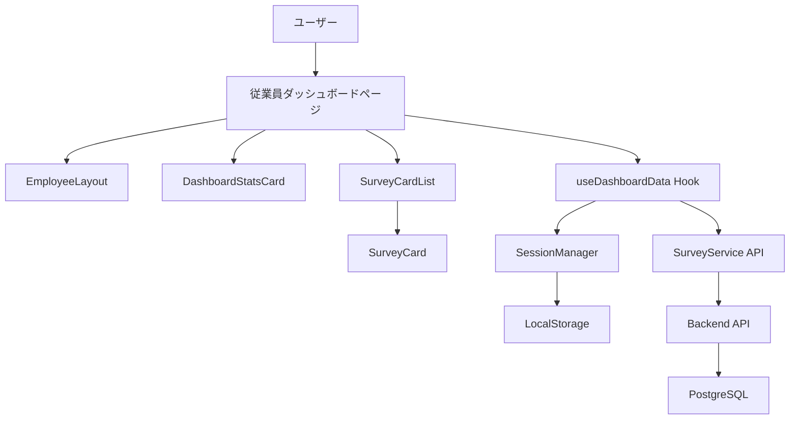
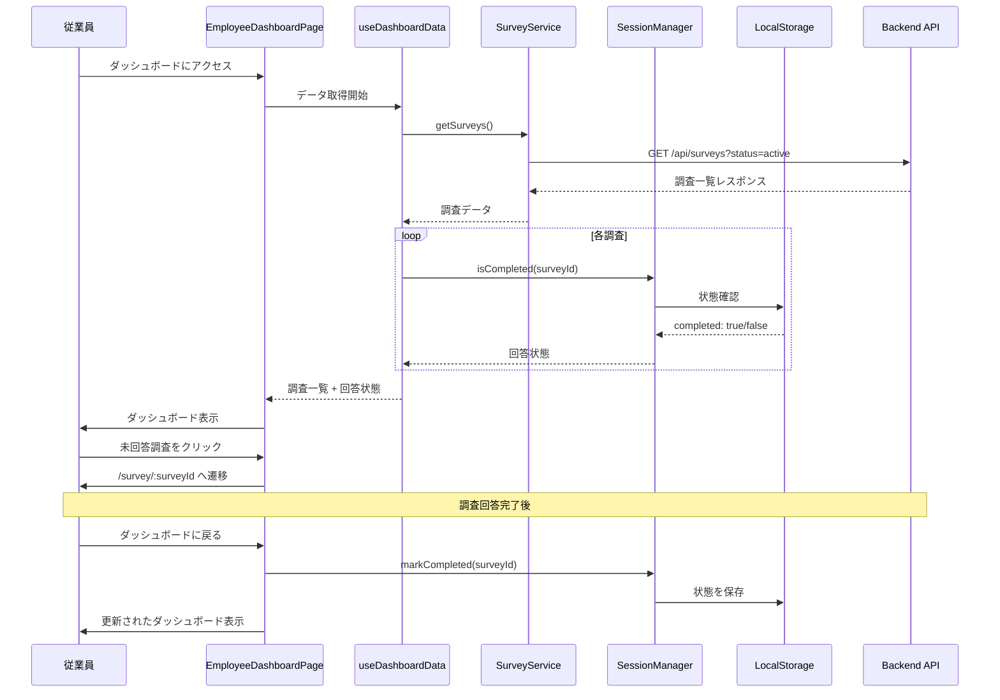
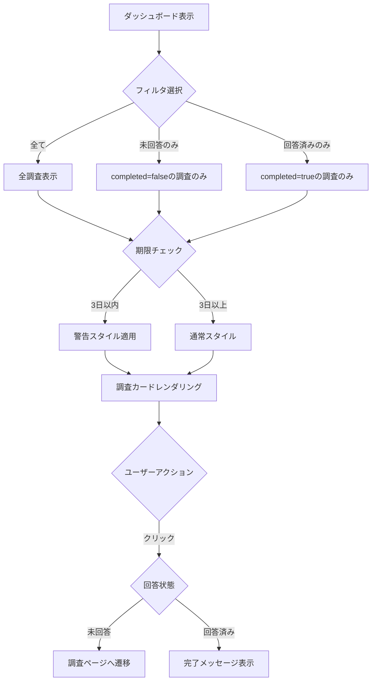
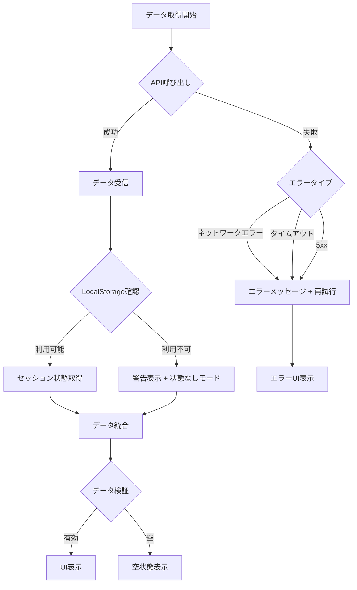

# 技術設計書

## 概要

従業員ダッシュボードは、一般従業員が組織サーベイへの参加状況を一目で把握し、未回答の調査に効率的にアクセスできる機能です。既存のReact + TypeScriptフロントエンドアプリケーションに新しいページコンポーネントとして統合され、完全匿名性を保ちながら、個別のセッション追跡によって回答状態を管理します。

**目的**: 従業員が調査への参加状況を把握し、未回答の調査を見逃さず完了できるようにすることで、組織全体の調査参加率とエンゲージメントを向上させます。

**対象ユーザー**: 一般従業員（認証済みユーザー）

**影響**: 現在のシステムにおいて、`/dashboard`ルートは開発中のプレースホルダーとなっています。本機能により、このルートに実際の従業員ダッシュボード機能を実装し、ログイン後のデフォルトランディングページとして機能させます。

### ゴール

- 公開中の調査一覧と個別の回答状態（未回答/回答済み）を表示
- LocalStorageベースのセッション管理による匿名性を保った回答追跡
- フィルタリング、期限強調、進捗可視化による優れたユーザビリティ
- レスポンシブデザインとアクセシビリティ対応による全デバイス・全ユーザーへの対応
- 既存のEmployeeLayoutとの統合による一貫したUI/UX

### 非ゴール

- 管理者向けダッシュボード機能（既存のAdminDashboardが担当）
- 調査結果の分析・可視化（既存のAnalyticsDashboardが担当）
- 新しい認証機能の実装（既存のAuthContextを利用）
- バックエンドAPIの大幅な変更（既存のSurveyServiceを活用）

## アーキテクチャ

### 既存アーキテクチャ分析

本プロジェクトは以下のアーキテクチャパターンを採用しています：

- **レイヤードアーキテクチャ**: Pages → Components → API Services → Backend
- **状態管理**: React Query（サーバー状態）+ Zustand（クライアント状態）
- **ルーティング**: React Router v6によるクライアントサイドルーティング
- **認証**: AuthContext + ProtectedRoute HOCによる認証制御
- **レイアウトパターン**: EmployeeLayout（従業員向け）とAdminLayout（管理者向け）の分離

既存の重要な統合ポイント：

- `App.tsx`: ルーティング定義とプロバイダー階層
- `AuthContext`: 認証状態管理とユーザー情報
- `EmployeeLayout`: 従業員向け共通レイアウト
- `SurveyService`: 調査データ取得とAPI通信
- `ProtectedRoute`: 認証ガード

### 高レベルアーキテクチャ



### 技術的整合性

**既存技術スタックとの整合性**:

- **React 18.2** + **TypeScript 5.3**: 既存のコンポーネント構造に従う
- **Tailwind CSS**: 既存UIコンポーネントのスタイリングパターンを踏襲
- **React Query**: SurveyListPageと同様のデータフェッチパターン
- **React Router**: App.tsxの既存ルーティング構造に統合

**新規導入ライブラリ**: なし（既存スタックのみで実装可能）

**ステアリング準拠**:

- `structure.md`: pages/配下に新規ページ、components/common/とcomponents/ui/を活用
- `tech.md`: React Query、Zustand、Tailwind CSSの既存パターンに従う
- `product.md`: 完全匿名性アーキテクチャ（LocalStorageセッション管理）を維持

### 主要な設計決定

#### 決定1: LocalStorageベースのセッション管理

**決定**: ブラウザのLocalStorageを使用して調査ごとの回答状態を追跡する

**背景**: 完全匿名性を保ちながら、個別ユーザーの回答状態を追跡する必要がある

**検討した代替案**:
1. **バックエンドのsessionsテーブルを利用**: 既存のセッション管理機能を活用
2. **Cookie + サーバーサイドセッション**: より安全だが匿名性が低下
3. **純粋なクライアントサイド状態管理（Zustand）**: 永続化がない

**選択したアプローチ**: LocalStorageによるクライアントサイド永続化

```typescript
interface SurveySession {
  surveyId: string;
  completed: boolean;
  lastAccessed: string;
}

class SessionManager {
  private readonly STORAGE_KEY = 'survey_sessions';
  
  getSessions(): SurveySession[] {
    const data = localStorage.getItem(this.STORAGE_KEY);
    return data ? JSON.parse(data) : [];
  }
  
  markCompleted(surveyId: string): void {
    const sessions = this.getSessions();
    const existing = sessions.find(s => s.surveyId === surveyId);
    
    if (existing) {
      existing.completed = true;
      existing.lastAccessed = new Date().toISOString();
    } else {
      sessions.push({
        surveyId,
        completed: true,
        lastAccessed: new Date().toISOString()
      });
    }
    
    localStorage.setItem(this.STORAGE_KEY, JSON.stringify(sessions));
  }
  
  isCompleted(surveyId: string): boolean {
    return this.getSessions().some(s => s.surveyId === surveyId && s.completed);
  }
}
```

**選択理由**:
- 完全匿名性を維持（サーバーに個人識別情報を送信しない）
- オフライン対応（ネットワーク不要で状態確認可能）
- 既存の`sessions`テーブルとの重複を避ける（異なる目的で設計されている）
- シンプルな実装で要件を満たす

**トレードオフ**:
- **獲得**: 完全匿名性、シンプルな実装、オフライン対応
- **犠牲**: デバイス間同期なし、ブラウザデータクリアで状態喪失、改ざんリスク

#### 決定2: ページレベルコンポーネントとしての実装

**決定**: `EmployeeDashboardPage`を新規ページコンポーネントとして実装し、`/dashboard`ルートに配置

**背景**: 既存の`/dashboard`ルートはプレースホルダーであり、実際の機能が必要

**検討した代替案**:
1. **HomePageを拡張**: ログイン前後で異なるコンテンツを表示
2. **モーダルダッシュボード**: ポップオーバーとして表示
3. **既存ページへの埋め込み**: SurveyListPageに統合

**選択したアプローチ**: 独立した新規ページコンポーネント

**選択理由**:
- 単一責任の原則（HomePageは未認証ユーザー向け）
- ルーティング構造の明確性（`/dashboard`は認証ユーザー専用）
- 既存のProtectedRoute HOCとの自然な統合
- 将来の拡張性（ダッシュボード機能の追加が容易）

**トレードオフ**:
- **獲得**: 明確な責任分離、拡張性、メンテナンス性
- **犠牲**: 新規ファイルの追加（最小限のオーバーヘッド）

## システムフロー

### ユーザーインタラクションフロー



### フィルタリングとステート管理フロー



## 要件トレーサビリティ

| 要件 | 要件概要 | コンポーネント | インターフェース | フロー |
|------|---------|--------------|----------------|--------|
| 1.1 | 公開中の調査一覧表示 | EmployeeDashboardPage | SurveyService.getSurveys() | ユーザーインタラクションフロー |
| 1.2 | 調査情報表示 | SurveyCard | Survey型定義 | - |
| 1.3 | 回答状態フィルタリング | FilterPanel | useDashboardData | フィルタリングフロー |
| 1.4 | 期限強調表示 | SurveyCard | DeadlineHighlight機能 | フィルタリングフロー |
| 1.5 | セッション状態追跡 | SessionManager | isCompleted(), markCompleted() | ユーザーインタラクションフロー |
| 2.1-2.4 | 調査参加フロー | EmployeeDashboardPage | React Router navigate | ユーザーインタラクションフロー |
| 3.1-3.4 | 進捗可視化 | DashboardStatsCard | ProgressBar, StatsDisplay | - |
| 4.1-4.4 | ナビゲーション統合 | EmployeeLayout, EmployeeNavigation | React Router Route | - |
| 5.1-5.5 | レスポンシブ・アクセシビリティ | 全コンポーネント | Tailwind responsive classes, ARIA | - |
| 6.1-6.4 | パフォーマンス・ユーザビリティ | useDashboardData | React Query caching | - |

## コンポーネントとインターフェース

### Presentation Layer

#### EmployeeDashboardPage

**責務と境界**
- **主要責務**: 従業員ダッシュボードのページ全体を管理し、調査一覧と進捗情報を表示
- **ドメイン境界**: プレゼンテーション層（ページコンポーネント）
- **データ所有権**: UIステート（フィルタリング状態、ソート順）
- **トランザクション境界**: なし（読み取り専用）

**依存関係**
- **インバウンド**: React Router（ルーティング）
- **アウトバウンド**: useDashboardData（データ取得）、EmployeeLayout（レイアウト）、DashboardStatsCard、SurveyCardList
- **外部**: なし

**コンポーネント構造**

```typescript
interface EmployeeDashboardPageProps {
  // プロップスなし（ルーティングから直接レンダリング）
}

interface DashboardUIState {
  filter: 'all' | 'pending' | 'completed';
  sortBy: 'deadline' | 'title';
}

// ページコンポーネント（frontend/src/pages/EmployeeDashboardPage.tsx）
export function EmployeeDashboardPage(): JSX.Element;
```

**インターフェース詳細**:
- React Routerの`/dashboard`ルートから直接レンダリング
- EmployeeLayoutでラップされて共通ヘッダー・ナビゲーションを含む
- ローディング、エラー、空状態の適切なハンドリング

#### DashboardStatsCard

**責務と境界**
- **主要責務**: 調査参加の統計情報（全体数、回答済み数、完了率）を表示
- **ドメイン境界**: プレゼンテーション層（UIコンポーネント）
- **データ所有権**: なし（propsで受け取った統計データの表示のみ）

**コンポーネント構造**

```typescript
interface DashboardStats {
  totalSurveys: number;
  completedSurveys: number;
  completionRate: number; // 0-100のパーセンテージ
}

interface DashboardStatsCardProps {
  stats: DashboardStats;
  loading?: boolean;
}

// 統計カードコンポーネント（frontend/src/components/common/DashboardStatsCard.tsx）
export function DashboardStatsCard({ stats, loading }: DashboardStatsCardProps): JSX.Element;
```

**表示要素**:
- 全体調査数のカウント
- 回答済み調査数のカウント
- 進捗バー（完了率の視覚表現）
- 完了率のパーセンテージ表示
- 全調査完了時の祝福メッセージ

#### SurveyCardList

**責務と境界**
- **主要責務**: 調査カードのリストをレスポンシブグリッドでレンダリング
- **ドメイン境界**: プレゼンテーション層（リストコンポーネント）
- **データ所有権**: なし（propsで受け取った調査データの表示のみ）

**コンポーネント構造**

```typescript
interface SurveyWithStatus extends Survey {
  isCompleted: boolean;
  isDeadlineNear: boolean; // 期限が3日以内
}

interface SurveyCardListProps {
  surveys: SurveyWithStatus[];
  onSurveyClick: (surveyId: string, isCompleted: boolean) => void;
  loading?: boolean;
  emptyMessage?: string;
}

// 調査カードリストコンポーネント（frontend/src/components/common/SurveyCardList.tsx）
export function SurveyCardList({ 
  surveys, 
  onSurveyClick, 
  loading,
  emptyMessage 
}: SurveyCardListProps): JSX.Element;
```

**レスポンシブレイアウト**:
- モバイル（sm未満）: 1列グリッド
- タブレット（md）: 2列グリッド
- デスクトップ（lg以上）: 3列グリッド

#### SurveyCard（拡張）

**責務と境界**
- **主要責務**: 個別の調査情報を視覚的に表現し、回答状態と期限を強調
- **ドメイン境界**: プレゼンテーション層（UIプリミティブ）
- **データ所有権**: なし（propsで受け取った調査データの表示のみ）

**既存コンポーネントの拡張**: `frontend/src/components/SurveyCard.tsx`を以下の機能で拡張

```typescript
interface SurveyCardProps {
  survey: Survey;
  isCompleted?: boolean; // 新規追加
  isDeadlineNear?: boolean; // 新規追加
  onClick?: (surveyId: string) => void;
  variant?: 'default' | 'compact'; // 新規追加
}

// 既存の調査カードコンポーネントを拡張
export function SurveyCard({ 
  survey, 
  isCompleted = false, 
  isDeadlineNear = false,
  onClick,
  variant = 'default'
}: SurveyCardProps): JSX.Element;
```

**新規表示要素**:
- 回答済みバッジ（緑色の"✓ 回答済み"）
- 期限警告バッジ（オレンジ色の"⚠ 期限間近"）
- 回答済み調査の視覚的な区別（低透明度、クリック無効）

### Data Access Layer

#### SessionManager（ユーティリティクラス）

**責務と境界**
- **主要責務**: LocalStorageを使用した調査セッション状態の永続化と管理
- **ドメイン境界**: データアクセス層（クライアントサイドストレージ）
- **データ所有権**: LocalStorageの`survey_sessions`キーのデータ
- **トランザクション境界**: 個別のLocalStorage操作（同期的）

**依存関係**
- **インバウンド**: useDashboardData（フック）、ページコンポーネント
- **アウトバウンド**: Browser LocalStorage API
- **外部**: なし

**クラス定義**

```typescript
interface SurveySession {
  surveyId: string;
  completed: boolean;
  lastAccessed: string; // ISO 8601形式
}

class SessionManager {
  private readonly STORAGE_KEY = 'survey_sessions';
  
  // セッション一覧を取得
  getSessions(): SurveySession[];
  
  // 調査を完了済みとしてマーク
  markCompleted(surveyId: string): void;
  
  // 調査が完了済みかを確認
  isCompleted(surveyId: string): boolean;
  
  // 特定の調査セッションを取得
  getSession(surveyId: string): SurveySession | undefined;
  
  // 古いセッションデータをクリーンアップ（30日以上前）
  cleanup(): void;
}

// シングルトンインスタンスをエクスポート
export const sessionManager = new SessionManager();
```

**ファイル配置**: `frontend/src/utils/sessionManager.ts`

**データ整合性**:
- JSONパース失敗時はデフォルト値（空配列）を返す
- `surveyId`の一意性を保証
- ISO 8601形式のタイムスタンプで時刻を記録

#### useDashboardData（カスタムフック）

**責務と境界**
- **主要責務**: ダッシュボードに必要なデータ（調査一覧 + 回答状態）の取得と集約
- **ドメイン境界**: データアクセス層（Reactフック）
- **データ所有権**: なし（SurveyServiceとSessionManagerからデータを取得）

**依存関係**
- **インバウンド**: EmployeeDashboardPage
- **アウトバウンド**: SurveyService（API）、SessionManager（LocalStorage）
- **外部**: React Query（キャッシュと状態管理）

**フック定義**

```typescript
interface DashboardData {
  surveys: SurveyWithStatus[];
  stats: DashboardStats;
  isLoading: boolean;
  error: Error | null;
  refetch: () => void;
}

// カスタムフック（frontend/src/hooks/useDashboardData.ts）
export function useDashboardData(): DashboardData {
  const { data: surveysResponse, isLoading, error, refetch } = useQuery(
    ['dashboard-surveys'],
    () => SurveyService.getSurveys({ status: 'active' }),
    {
      staleTime: 5 * 60 * 1000, // 5分間キャッシュ
      refetchOnWindowFocus: true,
    }
  );
  
  // 調査データとセッション状態を組み合わせ
  const surveys: SurveyWithStatus[] = useMemo(() => {
    if (!surveysResponse?.data) return [];
    
    return surveysResponse.data.map(survey => {
      const isCompleted = sessionManager.isCompleted(survey.id);
      const daysUntilDeadline = differenceInDays(
        new Date(survey.deadline),
        new Date()
      );
      
      return {
        ...survey,
        isCompleted,
        isDeadlineNear: daysUntilDeadline <= 3 && daysUntilDeadline >= 0
      };
    });
  }, [surveysResponse]);
  
  // 統計情報を計算
  const stats: DashboardStats = useMemo(() => {
    const totalSurveys = surveys.length;
    const completedSurveys = surveys.filter(s => s.isCompleted).length;
    const completionRate = totalSurveys > 0 
      ? Math.round((completedSurveys / totalSurveys) * 100)
      : 0;
    
    return { totalSurveys, completedSurveys, completionRate };
  }, [surveys]);
  
  return { surveys, stats, isLoading, error, refetch };
}
```

**外部依存関係の調査**:
- **React Query**: 既存プロジェクトで使用中（version 3.39.3）
- **date-fns**: 既存プロジェクトで使用中（日付計算に利用）
- 新規インストール不要

### Integration Layer

#### SurveyService（既存APIサービスの活用）

**既存実装の活用**: `frontend/src/api/services/surveyService.ts`の以下のメソッドを使用

```typescript
// 既存メソッドを活用（変更なし）
SurveyService.getSurveys({ status: 'active' }): Promise<PaginatedResponse<Survey>>
SurveyService.getSurveyById(surveyId: string): Promise<ApiResponse<Survey>>
```

**統合戦略**: 既存のAPIサービスをそのまま活用（変更不要）

**後方互換性**: 既存のSurveyListPage、SurveyDetailPageとの互換性を維持

## データモデル

### クライアントサイドデータモデル

#### SurveyWithStatus（表示用拡張型）

```typescript
// 既存のSurvey型を拡張
import { Survey } from '@/types/survey';

interface SurveyWithStatus extends Survey {
  // 既存フィールド（Survey型から継承）
  // id: string
  // title: string
  // description: string
  // deadline: string
  // status: 'draft' | 'active' | 'closed' | 'archived'
  // questions: Question[]
  // ...
  
  // 拡張フィールド
  isCompleted: boolean;      // LocalStorageから取得
  isDeadlineNear: boolean;   // 計算フィールド（期限3日以内）
}
```

**データソース**:
- `Survey`フィールド: Backend API（`/api/surveys`）
- `isCompleted`: LocalStorage（SessionManager）
- `isDeadlineNear`: クライアント計算（date-fns）

#### DashboardStats（統計情報）

```typescript
interface DashboardStats {
  totalSurveys: number;      // 公開中の調査総数
  completedSurveys: number;  // 回答済み調査数
  completionRate: number;    // 完了率（0-100のパーセンテージ）
}
```

**計算ロジック**:
```typescript
const totalSurveys = surveys.length;
const completedSurveys = surveys.filter(s => s.isCompleted).length;
const completionRate = totalSurveys > 0 
  ? Math.round((completedSurveys / totalSurveys) * 100) 
  : 0;
```

### LocalStorageデータスキーマ

#### SurveySession（永続化データ）

```typescript
interface SurveySession {
  surveyId: string;      // 調査ID（一意キー）
  completed: boolean;    // 回答完了フラグ
  lastAccessed: string;  // 最終アクセス日時（ISO 8601形式）
}

// LocalStorage保存形式
localStorage['survey_sessions']: string // JSON.stringify(SurveySession[])
```

**データ例**:
```json
[
  {
    "surveyId": "survey-123",
    "completed": true,
    "lastAccessed": "2025-10-06T14:22:00+09:00"
  },
  {
    "surveyId": "survey-456",
    "completed": false,
    "lastAccessed": "2025-10-05T10:15:00+09:00"
  }
]
```

**データ管理戦略**:
- 一意性: `surveyId`で重複を防止
- クリーンアップ: 30日以上アクセスのないセッションを削除
- 容量管理: LocalStorageの容量制限を考慮（通常5-10MB）

## エラーハンドリング

### エラー戦略

従業員ダッシュボードでは、ユーザー体験を損なわないグレースフルデグラデーションを採用します。API障害時も基本的なUIを表示し、ユーザーに明確なフィードバックを提供します。

### エラーカテゴリと対応

#### ユーザーエラー（4xx相当）

**シナリオ**: LocalStorageアクセス不可（プライベートモード、容量超過）

**対応**:
- セッション管理機能を無効化
- 警告メッセージ表示: "ブラウザの設定により、回答状態の保存ができません。調査への回答は可能です。"
- 回答状態なしで調査一覧を表示

**実装**:
```typescript
try {
  sessionManager.getSessions();
} catch (error) {
  console.warn('LocalStorage not available:', error);
  // フォールバック: 回答状態なしモード
  return surveys.map(s => ({ ...s, isCompleted: false, isDeadlineNear: false }));
}
```

#### システムエラー（5xx相当）

**シナリオ1**: API障害（`SurveyService.getSurveys()`失敗）

**対応**:
- React Queryのエラーステートを検出
- ユーザーフレンドリーなエラーメッセージ表示
- 再試行ボタンの提供
- エラーバウンダリによるアプリケーション全体の保護

**UIコンポーネント**:
```typescript
if (error) {
  return (
    <div className="text-center py-12">
      <p className="text-red-600 mb-4">
        調査データの取得に失敗しました。
      </p>
      <button 
        onClick={() => refetch()}
        className="bg-blue-600 text-white px-6 py-2 rounded"
      >
        再試行
      </button>
    </div>
  );
}
```

**シナリオ2**: ネットワークタイムアウト

**対応**:
- React QueryのデフォルトリトライメカニズムOFF（既存設定に従う）
- タイムアウト後にエラー表示
- React Queryのキャッシュを活用（5分間のstaleTime）

#### ビジネスロジックエラー（422相当）

**シナリオ**: 調査データが空（公開中の調査なし）

**対応**:
- エラーではなく、空状態として適切にハンドリング
- 空状態メッセージ表示: "現在、回答可能な調査はありません。"
- 空状態イラストレーションの表示

**実装**:
```typescript
if (surveys.length === 0 && !isLoading) {
  return (
    <div className="text-center py-12">
      <p className="text-gray-500 text-lg">
        現在、回答可能な調査はありません。
      </p>
    </div>
  );
}
```

### エラー処理フロー



### 監視とログ

**クライアントサイドロギング**:
- Console.error: API障害、LocalStorageエラー
- Console.warn: LocalStorage利用不可警告

**パフォーマンスモニタリング**:
- React Queryのdevtoolsでキャッシュヒット率確認
- コンソールでレンダリング時間を測定（開発環境）

## テスト戦略

### ユニットテスト

**対象**: 個別コンポーネントとユーティリティ関数

1. **SessionManager.test.ts** (`frontend/src/utils/__tests__/`)
   - `markCompleted()`: 調査を完了済みとしてマーク
   - `isCompleted()`: 調査の完了状態を正しく判定
   - `getSessions()`: LocalStorageからセッション一覧を取得
   - `cleanup()`: 古いセッションデータを削除
   - エッジケース: LocalStorage利用不可時のフォールバック

2. **useDashboardData.test.ts** (`frontend/src/hooks/__tests__/`)
   - 調査データとセッション状態の統合ロジック
   - 統計情報の計算（totalSurveys, completedSurveys, completionRate）
   - 期限警告フラグの計算（isDeadlineNear）
   - ローディング状態とエラー状態の処理
   - React Queryのキャッシュ動作

3. **DashboardStatsCard.test.tsx** (`frontend/src/components/common/__tests__/`)
   - 統計情報の正しい表示
   - 進捗バーの視覚的表現
   - 全調査完了時の祝福メッセージ
   - ローディング状態の表示

4. **SurveyCard.test.tsx** (既存テストに追加)
   - 回答済みバッジの表示
   - 期限警告バッジの表示
   - 回答済み調査のクリック無効化

### 統合テスト

**対象**: コンポーネント間の連携とデータフロー

1. **EmployeeDashboardPage統合テスト** (`frontend/src/pages/__tests__/`)
   - ページ全体のレンダリングとレイアウト統合
   - useDashboardDataフックとのデータ連携
   - フィルタリング機能の動作
   - 調査カードクリック時のナビゲーション
   - エラー状態と空状態の表示

2. **SurveyCardList統合テスト** (`frontend/src/components/common/__tests__/`)
   - レスポンシブグリッドレイアウトの検証
   - 複数のSurveyCardの正しいレンダリング
   - onSurveyClickコールバックの呼び出し

3. **API + LocalStorage統合テスト**
   - SurveyServiceからのデータ取得
   - SessionManagerによる状態管理
   - データ統合ロジックの検証

### E2Eテスト（Playwright）

**対象**: ユーザーシナリオ全体の動作確認

1. **ダッシュボード基本フロー** (`tests/e2e/employee-dashboard-basic.spec.ts`)
   - ログイン後にダッシュボードが表示される
   - 公開中の調査一覧が正しく表示される
   - 統計情報（調査数、完了率）が正しく計算される
   - フィルタリング（全て/未回答のみ/回答済みのみ）が動作する

2. **調査回答フロー** (`tests/e2e/employee-dashboard-response.spec.ts`)
   - 未回答調査をクリックして調査ページに遷移
   - 調査を完了してダッシュボードに戻る
   - 回答状態が「回答済み」に更新される
   - LocalStorageに状態が永続化される

3. **期限警告表示** (`tests/e2e/employee-dashboard-deadline.spec.ts`)
   - 期限が3日以内の調査に警告バッジが表示される
   - 期限が過ぎた調査が適切に表示される

4. **レスポンシブデザイン** (`tests/e2e/employee-dashboard-responsive.spec.ts`)
   - モバイルビューポートで1列グリッド
   - タブレットビューポートで2列グリッド
   - デスクトップビューポートで3列グリッド

5. **エラーハンドリング** (`tests/e2e/employee-dashboard-errors.spec.ts`)
   - API障害時のエラーメッセージ表示
   - 再試行ボタンの動作
   - LocalStorage無効時の警告表示

### パフォーマンステスト

**対象**: レンダリング速度とユーザー体験

1. **初回ロード時間**
   - 2秒以内にコンテンツ表示（要件6.1）
   - React Queryのキャッシュヒット後は1秒以内

2. **フィルタリング応答性**
   - フィルタ変更後200ms以内に結果反映（要件6.4）
   - useMemoによる再計算の最適化

3. **大量データ処理**
   - 50件の調査データでもスムーズにレンダリング
   - 仮想化スクロール（必要に応じて将来実装）

## セキュリティ考慮事項

### 認証と認可

**既存のAuthContextを活用**:
- `/dashboard`ルートはProtectedRouteでラップ（既存パターン）
- 認証されたユーザーのみアクセス可能
- 未認証ユーザーは自動的に`/login`にリダイレクト

**実装**:
```typescript
// App.tsx（既存パターンに従う）
<Route
  path="/dashboard"
  element={
    <ProtectedRoute>
      <EmployeeDashboardPage />
    </ProtectedRoute>
  }
/>
```

### データ保護とプライバシー

**完全匿名性の維持**:
- LocalStorageに保存されるのは`surveyId`と回答状態のみ
- 個人識別情報（ユーザーID、名前、メールアドレス）は一切保存しない
- バックエンドAPIへの送信データも最小限

**LocalStorageのセキュリティ**:
- XSS対策: Reactのデフォルトエスケープ機能を活用
- データ改ざんのリスク: 影響範囲はクライアント側の表示のみ（バックエンドデータには影響なし）
- センシティブデータなし: 調査IDと回答状態のみで、悪用リスクは低い

### コンプライアンス

**既存のプライバシーポリシーへの準拠**:
- 匿名性保証アーキテクチャに従う（`product.md`）
- LocalStorageの使用をプライバシーポリシーに明記（推奨）

## パフォーマンスと スケーラビリティ

### ターゲットメトリクス

**要件から導出**:
- 初回ロード時間: 2秒以内（要件6.1）
- フィルタリング応答: 200ms以内（要件6.4）
- APIレスポンス: 1秒以内（バックエンド依存）

### スケーリング戦略

**クライアントサイドパフォーマンス**:

1. **React Queryキャッシング**
   - staleTime: 5分間（頻繁な再取得を防止）
   - refetchOnWindowFocus: true（最新データの自動取得）
   - デフォルトリトライ: 1回のみ

2. **useMemoによる計算最適化**
   - `surveys`配列の計算結果をメモ化
   - `stats`の計算結果をメモ化
   - 依存配列の適切な管理

3. **レスポンシブ画像とアセット**
   - Tailwind CSSのユーティリティクラスのみ使用（画像なし）
   - SVGアイコンによる軽量化

**将来のスケーラビリティ**:

1. **大量データ対応**
   - 現状: 50件程度の調査を想定
   - 将来: react-windowによる仮想化スクロール
   - ページネーション機能の追加

2. **オフライン対応**
   - LocalStorageによる基本的なオフライン対応は既に実現
   - 将来: Service Workerによるキャッシュ戦略

### 最適化技術

**コード分割**:
- EmployeeDashboardPageのlazy loading（React.lazy）
- React Routerのcode-splittingパターン

**バンドルサイズ最適化**:
- 既存ライブラリのみ使用（新規依存関係なし）
- Tree-shakingによる未使用コードの削除（Viteのデフォルト）

**レンダリング最適化**:
- React.memoによる不要な再レンダリング防止（必要に応じて）
- useMemoとuseCallbackの適切な使用
