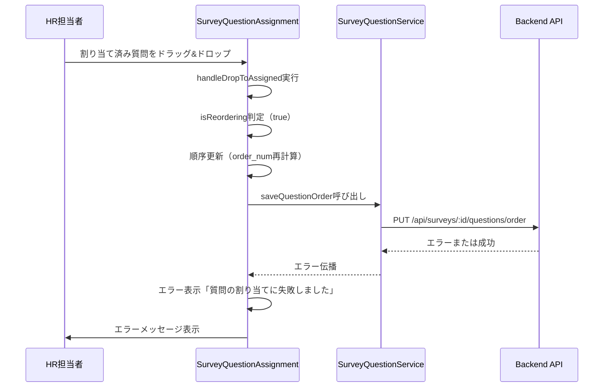
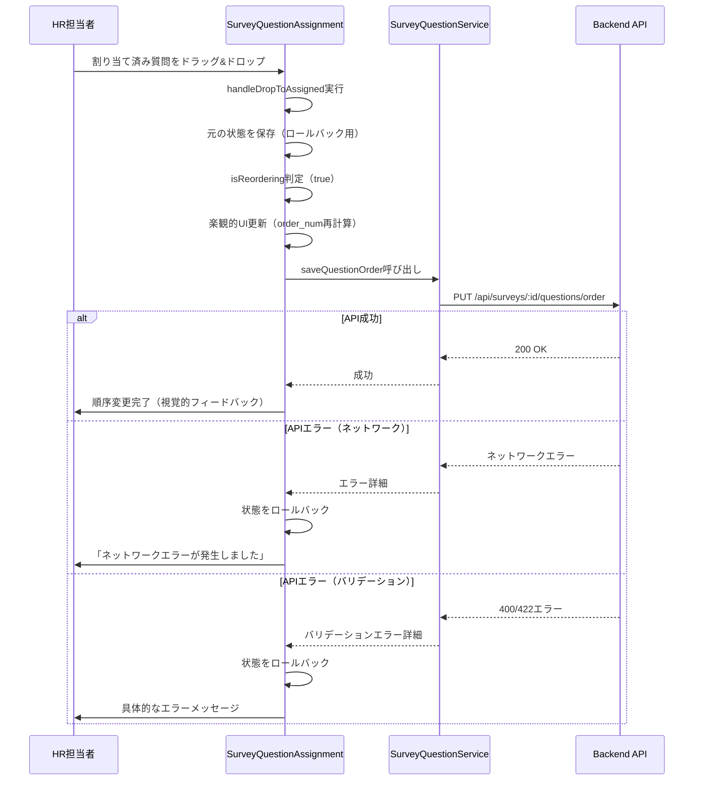
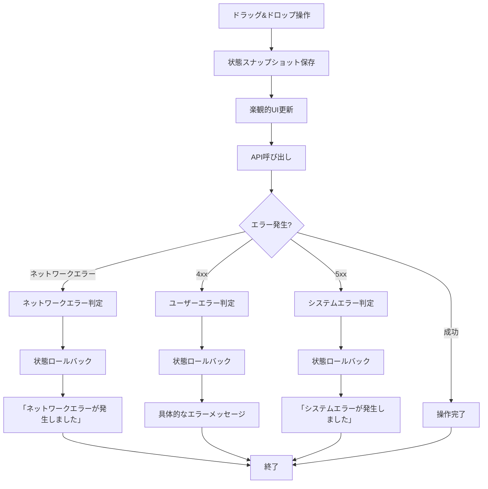

# 技術設計書

## 概要

**目的**: 質問割り当て画面（SurveyQuestionAssignment）における2つの不具合を修正する。第一に、割り当て済み質問セクションの見出しから質問数のカウント表示を削除し、シンプルで見やすいUIを提供する。第二に、質問の順序変更時に発生する「質問の割り当てに失敗しました」エラーを解消し、ドラッグ&ドロップによる順序変更を安定して動作させる。

**ユーザー**: HR担当者が調査の質問を効率的に管理できるようになる。直感的な操作で質問の順序変更が可能となり、エラーによる作業中断を防ぐ。

**影響**: 既存のSurveyQuestionAssignmentコンポーネントとSurveyQuestionServiceクラスの一部を修正する。バックエンドAPIとの統合を確認し、エラーハンドリングを強化する。

### ゴール
- 割り当て済み質問セクションからカウント表示を削除し、UIをシンプル化する
- 質問順序変更時のエラーを解消し、安定した動作を実現する
- エラーハンドリングを改善し、具体的でユーザーフレンドリーなエラーメッセージを提供する
- 状態管理の整合性を確保し、エラー時の適切なロールバックを実装する

### 非ゴール
- 新しいドラッグ&ドロップライブラリの導入（既存実装を活用）
- 質問割り当て機能の大規模なリファクタリング
- バックエンドAPIエンドポイントの変更（既存APIを前提とする）
- 質問管理機能全体の再設計

## アーキテクチャ

### 既存アーキテクチャ分析

現在のシステムは以下のパターンで構築されている:
- **フロントエンド**: Reactコンポーネントベースアーキテクチャ
- **状態管理**: React hooksによるローカル状態管理（useState）
- **API通信**: サービスクラス（SurveyQuestionService）によるREST API呼び出し
- **ドラッグ&ドロップ**: ネイティブHTML5 Drag and Drop API

**既存のドメイン境界**:
- `SurveyQuestionAssignment`コンポーネント: UI表示とユーザーインタラクション
- `SurveyQuestionService`: バックエンドAPIとの通信を担当
- ドラッグ&ドロップロジック: コンポーネント内に実装

**保持すべき統合ポイント**:
- `SurveyQuestionService.assignQuestions()`: 質問の割り当て
- `SurveyQuestionService.updateQuestionOrder()`: 順序の更新
- `SurveyQuestionService.getSurveyQuestions()`: 質問データの取得

### システムフロー

#### 修正前の問題フロー



#### 修正後の正常フロー



### 技術スタック整合性

既存の技術スタックに完全に準拠:
- **フロントエンド**: React 18.2.0 + TypeScript 5.3.3
- **状態管理**: React hooks（useState）
- **API通信**: Axios（apiClient経由）
- **スタイリング**: Tailwind CSS

**新規依存関係**: なし（既存実装を活用）

**既存パターンとの整合性**:
- コンポーネント内状態管理パターンを維持
- サービスクラスによるAPI抽象化を維持
- エラーハンドリングパターン（try-catch）を維持

### 主要な設計決定

#### 決定1: エラーハンドリングの段階的改善

**決定**: エラーメッセージを具体化し、エラーの種類に応じた適切なメッセージを表示する。また、エラー時に状態をロールバックする仕組みを追加する。

**コンテキスト**: 現在のエラーハンドリングは包括的なメッセージ「質問の割り当てに失敗しました」のみを表示しており、ユーザーは原因を特定できない。また、エラー発生時にUI状態が不整合になる可能性がある。

**代替案**:
1. **現状維持**: 包括的なエラーメッセージのみ
2. **トースト通知の追加**: より詳細なエラー情報をトースト形式で表示
3. **エラーモーダルの導入**: エラー詳細とリトライオプションを含むモーダル

**選択したアプローチ**: エラーメッセージの具体化 + 状態ロールバック

エラーの種類を判別し（ネットワークエラー、バリデーションエラー、システムエラー）、それぞれに適したメッセージを表示する。また、try-catchブロック内でエラー発生前の状態を保存し、エラー時に復元する。

**理由**:
- 既存のUIコンポーネント（Alert）を活用できる
- 実装コストが低く、既存パターンに準拠
- ユーザーがエラー原因を理解しやすい
- 状態の整合性を保証できる

**トレードオフ**:
- **獲得**: ユーザーフレンドリーなエラーメッセージ、状態の整合性、デバッグの容易さ
- **犠牲**: トースト通知のような高度なUXは実現できない（将来的な改善余地）

#### 決定2: 楽観的UIと状態ロールバック戦略

**決定**: ドラッグ&ドロップ時にUIを即座に更新（楽観的UI）し、APIエラー時に元の状態にロールバックする。

**コンテキスト**: 現在の実装では楽観的UIを採用しているが、エラー時のロールバックが不完全で、UI状態とバックエンド状態の不整合が発生する可能性がある。

**代替案**:
1. **悲観的UI**: API成功後にのみUI更新（レスポンス遅延）
2. **楽観的UI + 不完全ロールバック**: 現状維持
3. **楽観的UI + 完全ロールバック**: エラー時に元の状態を完全復元

**選択したアプローチ**: 楽観的UI + 完全ロールバック

ドラッグ&ドロップ時に元の状態（assignedQuestions、availableQuestions）を保存し、APIエラー時に完全に復元する。

**理由**:
- ユーザー体験が向上（即座のフィードバック）
- エラー時の整合性を保証
- 既存の楽観的UIパターンを維持しつつ、信頼性を向上

**トレードオフ**:
- **獲得**: 高速なUI応答、エラー時の安全な復元、ユーザー体験の向上
- **犠牲**: わずかなメモリオーバーヘッド（状態のコピー保持）

## 要件のトレーサビリティ

| 要件 | 要件概要 | コンポーネント | インターフェース | フロー |
|------|---------|-------------|-------------|--------|
| 1.1 | 割り当て済み質問のカウント表示削除 | SurveyQuestionAssignment | UI表示ロジック | N/A（単純なUI修正） |
| 2.1 | ドラッグ&ドロップによる順序変更 | SurveyQuestionAssignment | handleDropToAssigned | 修正後の正常フロー |
| 2.2 | エラーメッセージの解消 | SurveyQuestionAssignment, SurveyQuestionService | saveQuestionOrder, updateQuestionOrder | 修正後の正常フロー（エラー処理） |
| 3.1-3.4 | エラーハンドリングの改善 | SurveyQuestionAssignment | handleDropToAssigned, エラー判別ロジック | 修正後の正常フロー（エラー分岐） |
| 4.1-4.4 | ドラッグ&ドロップ機能の整合性 | SurveyQuestionAssignment | handleDropToAssigned, handleDropToAvailable | 修正後の正常フロー |

## コンポーネントとインターフェース

### フロントエンド層

#### SurveyQuestionAssignment（修正）

**責任と境界**
- **主要な責任**: 質問割り当て画面のUI表示とユーザーインタラクションの管理
- **ドメイン境界**: 調査管理ドメイン（質問割り当てサブドメイン）
- **データ所有**: 画面表示用の質問リスト（availableQuestions、assignedQuestions）、フィルタ状態、エラー状態
- **トランザクション境界**: 単一の質問割り当て操作または順序変更操作

**依存関係**
- **インバウンド**: AdminLayoutからのルーティング
- **アウトバウンド**: SurveyQuestionService（API通信）、UIコンポーネント（Card、Button、Alert、Input、Loading）
- **外部**: React Router（useParams）

**契約定義**

**修正対象の関数シグネチャ**:
```typescript
// 修正前
const handleDropToAssigned = async (e: React.DragEvent, insertIndex?: number): Promise<void>;

// 修正後（エラーハンドリング強化）
const handleDropToAssigned = async (e: React.DragEvent, insertIndex?: number): Promise<void>;

// エラー判別ヘルパー関数（新規追加）
const getErrorMessage = (error: unknown): string;

// 状態ロールバックヘルパー関数（新規追加）
const saveStateSnapshot = (): StateSnapshot;
const restoreStateSnapshot = (snapshot: StateSnapshot): void;

// 型定義
interface StateSnapshot {
  assignedQuestions: SurveyQuestion[];
  availableQuestions: SurveyQuestion[];
}
```

**事前条件**:
- surveyIdがURLパラメータから取得可能
- ドラッグされた質問（draggedItem）が存在する
- バックエンドAPIが正常に動作している

**事後条件**:
- 成功時: assignedQuestionsが更新され、バックエンドに同期される
- エラー時: 元の状態が復元され、適切なエラーメッセージが表示される

**不変条件**:
- assignedQuestions内の各質問のorder_numは1から連番
- assignedQuestionsとavailableQuestionsに重複する質問IDが存在しない

**UI修正箇所**:
```typescript
// 修正前（355行目付近）
<h2 className="text-lg font-semibold text-gray-900">
  割り当て済み質問 ({assignedQuestions.length})
</h2>

// 修正後
<h2 className="text-lg font-semibold text-gray-900">
  割り当て済み質問
</h2>
```

**統合戦略**:
- **修正アプローチ**: 既存コードを拡張（handleDropToAssigned関数の改善、ヘルパー関数の追加）
- **後方互換性**: UI変更は視覚的な変更のみで、既存の機能を維持
- **移行パス**: 段階的デプロイ（UIの修正 → エラーハンドリング強化 → テスト）

#### SurveyQuestionService（修正確認）

**責任と境界**
- **主要な責任**: バックエンドAPIとの通信を抽象化し、質問割り当て関連のAPIコールを管理
- **ドメイン境界**: API通信層（調査と質問の関連管理）
- **データ所有**: APIリクエスト/レスポンスの変換とマッピング
- **トランザクション境界**: 個別のAPI呼び出し単位

**依存関係**
- **インバウンド**: SurveyQuestionAssignmentコンポーネント
- **アウトバウンド**: apiClient（Axios instance）、バックエンドREST API
- **外部**: Axios（HTTP通信）

**契約定義**

**確認が必要なメソッド**:
```typescript
class SurveyQuestionService {
  /**
   * 質問の順序を更新する
   * バックエンドAPI: PUT /api/surveys/:surveyId/questions/order
   */
  static async updateQuestionOrder(
    surveyId: string, 
    questionIds: number[]
  ): Promise<void>;
}
```

**事前条件**:
- surveyIdが有効な調査ID
- questionIdsが有効な質問IDの配列
- バックエンドAPIエンドポイント`PUT /api/surveys/:surveyId/questions/order`が実装されている

**事後条件**:
- 成功時: バックエンドの質問順序が更新される
- エラー時: エラーがスローされ、呼び出し元でキャッチされる

**不変条件**:
- APIレスポンスのステータスコードに応じたエラーハンドリング

**統合戦略**:
- **修正アプローチ**: 既存のメソッドを維持し、バックエンドAPIの存在を確認
- **後方互換性**: メソッドシグネチャは変更なし
- **移行パス**: バックエンドAPIの実装確認 → エラーレスポンスの詳細化（必要に応じて）

## エラーハンドリング

### エラー戦略

質問割り当て操作におけるエラーを3つのカテゴリに分類し、それぞれに適切なハンドリングと復旧メカニズムを適用する:

1. **ユーザーエラー（4xx）**: 不正な入力や無効な操作に対する検証とガイダンス
2. **システムエラー（5xx）**: バックエンドやインフラの障害に対する graceful degradation
3. **ネットワークエラー**: 接続障害やタイムアウトに対するリトライとフォールバック

### エラーカテゴリと対応

#### ユーザーエラー（4xx）
- **400 Bad Request**: 無効なリクエストパラメータ
  - **対応**: フィールドレベルのバリデーションメッセージ「リクエストが不正です。再度お試しください。」
  - **復旧**: 状態をロールバックし、ユーザーに再操作を促す

- **404 Not Found**: 存在しない調査IDまたは質問ID
  - **対応**: 「指定された調査または質問が見つかりません。」
  - **復旧**: 状態をロールバックし、調査一覧へのナビゲーションを提案

- **422 Unprocessable Entity**: ビジネスルール違反（例: 重複した質問割り当て）
  - **対応**: 「この質問は既に割り当てられています。」
  - **復旧**: 状態をロールバックし、最新データを再取得

#### システムエラー（5xx）
- **500 Internal Server Error**: バックエンドの内部エラー
  - **対応**: 「システムエラーが発生しました。しばらくしてから再度お試しください。」
  - **復旧**: 状態をロールバックし、graceful degradation（操作を無効化）

- **503 Service Unavailable**: バックエンドサービスの一時的な停止
  - **対応**: 「サービスが一時的に利用できません。しばらくしてから再度お試しください。」
  - **復旧**: 状態をロールバックし、リトライを促す

#### ネットワークエラー
- **接続タイムアウト**: APIリクエストがタイムアウト
  - **対応**: 「ネットワークエラーが発生しました。接続を確認してください。」
  - **復旧**: 状態をロールバックし、リトライボタンを表示

- **ネットワーク切断**: インターネット接続が失われた
  - **対応**: 「ネットワーク接続が失われました。接続を確認してください。」
  - **復旧**: 状態をロールバックし、オフラインモードの表示（将来的な改善）

### エラーハンドリングフロー



### 実装詳細

```typescript
// エラー判別ヘルパー関数
const getErrorMessage = (error: unknown): string => {
  if (axios.isAxiosError(error)) {
    if (!error.response) {
      // ネットワークエラー
      return 'ネットワークエラーが発生しました。接続を確認してください。';
    }
    
    const status = error.response.status;
    
    if (status === 404) {
      return '指定された調査または質問が見つかりません。';
    } else if (status === 422) {
      return 'この質問は既に割り当てられています。';
    } else if (status >= 400 && status < 500) {
      return 'リクエストが不正です。再度お試しください。';
    } else if (status >= 500) {
      return 'システムエラーが発生しました。しばらくしてから再度お試しください。';
    }
  }
  
  return '質問の割り当てに失敗しました。再度お試しください。';
};

// 状態管理
interface StateSnapshot {
  assignedQuestions: SurveyQuestion[];
  availableQuestions: SurveyQuestion[];
}

const saveStateSnapshot = (): StateSnapshot => ({
  assignedQuestions: [...assignedQuestions],
  availableQuestions: [...availableQuestions],
});

const restoreStateSnapshot = (snapshot: StateSnapshot): void => {
  setAssignedQuestions(snapshot.assignedQuestions);
  setAvailableQuestions(snapshot.availableQuestions);
};
```

### 監視

**エラートラッキング**:
- コンソールログによるエラー詳細の記録（開発環境）
- エラーの種類とHTTPステータスコードの記録
- 将来的な改善: Sentry等のエラー監視ツールとの統合

**ロギング**:
- `console.error()`によるエラーログ出力
- エラー発生時のコンテキスト情報（surveyId、操作種別）

**ヘルスモニタリング**:
- ユーザーからのエラー報告による問題の早期発見
- 将来的な改善: APMツールによるAPIレスポンスタイムの監視

## テスト戦略

### ユニットテスト

1. **getErrorMessage関数のテスト**
   - ネットワークエラー（error.response === undefined）の判定
   - HTTPステータスコード別のメッセージ生成（404, 422, 4xx, 5xx）
   - 不明なエラーのフォールバックメッセージ

2. **saveStateSnapshot関数のテスト**
   - 状態の正確なスナップショット作成
   - 元の状態への影響がないこと（イミュータブル性）

3. **restoreStateSnapshot関数のテスト**
   - スナップショットからの状態復元
   - assignedQuestionsとavailableQuestionsの正確な復元

4. **handleDropToAssigned関数のロジックテスト**
   - isReordering判定ロジックの正確性
   - order_numの再計算ロジック
   - 状態ロールバックのトリガー条件

### 統合テスト

1. **質問順序変更の成功フロー**
   - ドラッグ&ドロップ操作 → API成功 → UI更新確認
   - order_numの正確な更新とバックエンド同期

2. **質問順序変更のエラーフロー（ネットワークエラー）**
   - ドラッグ&ドロップ操作 → API失敗（ネットワーク） → 状態ロールバック → エラーメッセージ表示

3. **質問順序変更のエラーフロー（バリデーションエラー）**
   - ドラッグ&ドロップ操作 → API失敗（422） → 状態ロールバック → 具体的エラーメッセージ表示

4. **新規質問割り当ての成功フロー**
   - 利用可能な質問から割り当てリストへのドラッグ → API成功 → 両リストの正確な更新

5. **SurveyQuestionService.updateQuestionOrderのモックテスト**
   - API呼び出しの正確性（エンドポイント、ペイロード）
   - エラーレスポンスの適切な伝播

### E2E/UIテスト

1. **割り当て済み質問セクションの表示確認**
   - 見出しテキストが「割り当て済み質問」のみであること
   - カウント表示「(2)」が存在しないこと

2. **質問順序変更の完全なユーザーフロー**
   - 質問割り当て画面にアクセス
   - 割り当て済み質問をドラッグ&ドロップで順序変更
   - 視覚的フィードバック（ドラッグオーバー時のハイライト）
   - 順序変更の永続化（ページリロード後も順序が保持される）

3. **エラー発生時のユーザー体験**
   - ネットワークエラーをシミュレート → エラーメッセージ表示 → 元の順序に戻る
   - バリデーションエラーをシミュレート → 具体的エラーメッセージ表示

4. **複数質問の連続的な順序変更**
   - 複数の質問を連続してドラッグ&ドロップ
   - 各操作後の状態整合性確認

5. **質問割り当てとアンアサインの組み合わせ**
   - 新規質問の割り当て → 順序変更 → 質問のアンアサイン → 整合性確認

### パフォーマンス/負荷テスト

1. **大量の質問の表示とフィルタリング**
   - 100件以上の質問がある場合の画面レンダリングパフォーマンス
   - フィルタ操作時の応答速度

2. **順序変更の連続操作**
   - 10回連続の順序変更操作 → レスポンスタイム計測
   - API呼び出しの並列制御（必要に応じて）

3. **エラー時のメモリリークチェック**
   - エラー発生 → 状態ロールバック → メモリ使用量の確認
   - 繰り返しのエラー操作でメモリが増加しないこと

4. **ドラッグ&ドロップのUI応答性**
   - ドラッグ操作時のフレームレート（60fps維持）
   - 大量の質問がある場合でもスムーズなドラッグ操作

## セキュリティ考慮事項

### 既存のセキュリティ制御

- **認証**: 現在は未実装（将来的にMicrosoft 365 SSO予定）
- **CORS制限**: バックエンドでオリジン検証
- **入力検証**: Zodによるリクエストバリデーション（バックエンド）
- **SQLインジェクション対策**: パラメータ化クエリ（バックエンド）

### 本機能での追加考慮事項

**脅威モデリング**:
- **CSRF攻撃**: 質問順序の不正な変更
  - **対策**: 既存のCORS制限を維持、CSRFトークンの追加（将来的な改善）
  
- **ドラッグ&ドロップによるXSS**: 質問テキストの不正なスクリプト埋め込み
  - **対策**: Reactのデフォルトのエスケープ処理を維持、質問テキストのサニタイゼーション（バックエンド）

- **レート制限の欠如**: 大量の順序変更リクエストによるDoS
  - **対策**: バックエンドのレート制限機能を活用（既存）

**データ保護**:
- **機密データの露出**: 質問内容は組織の機密情報ではないが、適切なアクセス制御が必要
  - **対策**: 将来的な認証実装により、HR担当者のみアクセス可能に制限

**認可**:
- **権限チェック**: 現在は未実装だが、将来的にHR担当者のみが質問割り当てを変更できるよう制限
  - **対策**: 認証実装後、役割ベースアクセス制御（RBAC）を導入

### セキュリティベストプラクティス

- **最小権限の原則**: 質問割り当て機能は必要な操作のみを許可
- **防御的プログラミング**: エラーハンドリングで予期しない状態を防ぐ
- **監査ログ**: 将来的な改善として、質問割り当て変更の監査ログを記録
