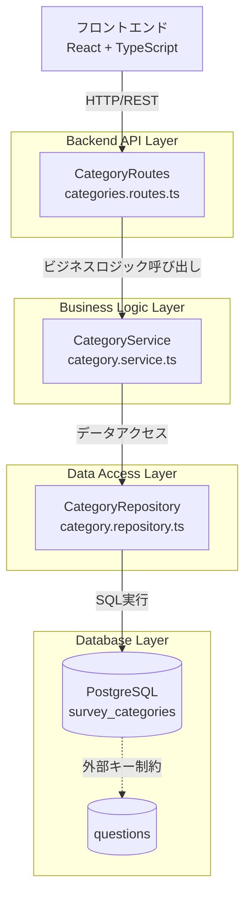
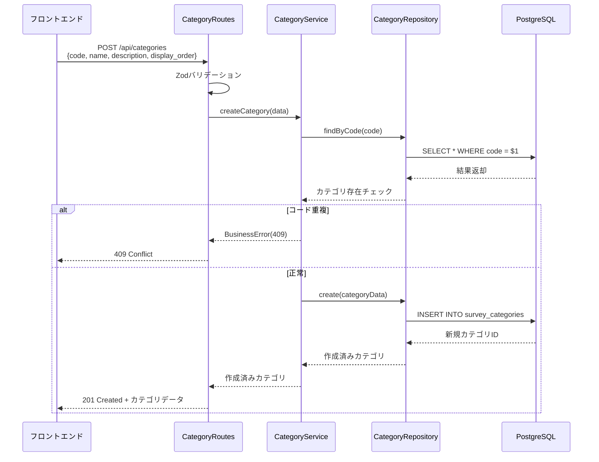
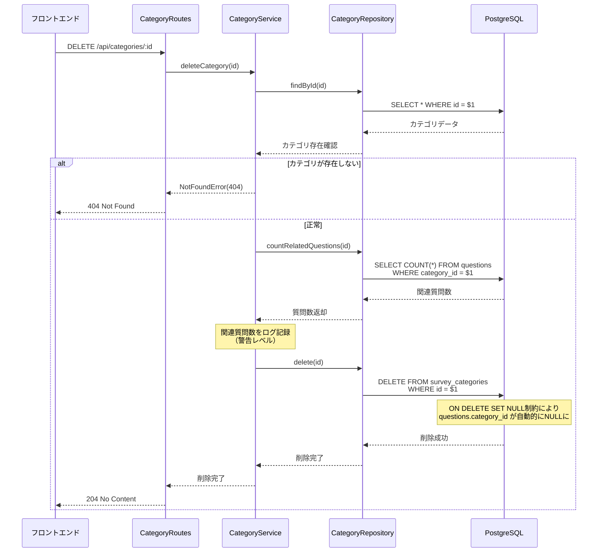
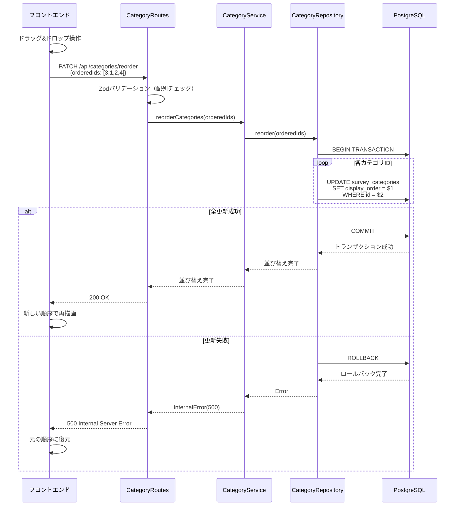

# 技術設計書 (Technical Design Document)

## 概要

質問カテゴリ管理機能は、HR担当者が調査カテゴリ（A-G: 仕事について、最近の状態について等）を管理するための管理機能です。既存の`survey_categories`テーブルと関連するビジネスロジックに基づき、CRUD操作、並び替え、有効/無効切り替えなどの機能を提供します。

**目的**: この機能はHR担当者にカテゴリ管理の柔軟性を提供します。
**ユーザー**: HR担当者およびシステム管理者が、調査の目的に応じたカテゴリのカスタマイズと整理のために利用します。
**影響**: 既存の`survey_categories`テーブルに対する管理UIとAPIエンドポイントを追加します。質問との関連は維持され、カテゴリ削除時は`questions.category_id`がNULLに設定されます（ON DELETE SET NULL）。

### 目標
- 既存カテゴリの一覧表示、作成、編集、削除機能の提供
- カテゴリの有効/無効切り替えと並び替え機能の実装
- 関連質問数の表示と影響範囲の可視化
- 既存のレイヤードアーキテクチャパターンの遵守

### 対象外
- カテゴリに関連する質問の一括編集（将来検討）
- カテゴリのインポート/エクスポート機能（将来検討）
- 複数カテゴリの一括操作（将来検討）

## アーキテクチャ

### 既存アーキテクチャ分析

**現在のアーキテクチャパターン**: レイヤードアーキテクチャ
- **Routes層**: HTTPリクエスト/レスポンス処理、Zodによるバリデーション
- **Services層**: ビジネスロジック、トランザクション制御
- **Repositories層**: データアクセス抽象化、SQL実行
- **Database層**: PostgreSQL接続、コネクションプール管理

**既存ドメイン境界**:
- Question Domain: 質問管理（questions, survey_questions）
- Survey Domain: 調査管理（surveys）
- Response Domain: 回答管理（responses, response_sessions）
- Analytics Domain: 分析機能（analytics_cache）
- **Category Domain** (新規): カテゴリ管理（survey_categories）

**維持すべき統合ポイント**:
- `questions.category_id → survey_categories.id` の外部キー制約（ON DELETE SET NULL）
- 分析サービスのカテゴリフィルタリング機能との互換性
- 既存のZodバリデーションパターン

### 高レベルアーキテクチャ



**アーキテクチャ統合**:
- **既存パターン維持**: Routes → Services → Repositories → Database の依存関係
- **新規コンポーネントの理由**: カテゴリドメインの責務を明確に分離し、単一責任の原則を遵守
- **技術スタック整合性**: Fastify, Zod, pg（node-postgres）、既存のエラーハンドリングパターンを踏襲
- **ステアリング準拠**: structure.mdのレイヤードアーキテクチャ原則、tech.mdの技術選定基準を遵守

### 技術スタック整合性

既存システムとの技術的整合性を確保：

**バックエンド技術（既存）**:
- **フレームワーク**: Fastify 4.25.2 - 既存のAPIパターンを踏襲
- **バリデーション**: Zod 3.22.4 - 既存のスキーマ定義パターンを利用
- **データベース**: pg (node-postgres) 8.11.3 - 既存のコネクションプール、トランザクション管理を活用
- **ロギング**: Pino 8.17.2 - 既存のログフォーマットを維持

**フロントエンド技術（既存）**:
- **フレームワーク**: React 18.2.0 + TypeScript 5.3.3
- **状態管理**: Zustand 5.0.8（ローカル状態）、React Query 3.39.3（サーバー状態）
- **フォーム**: React Hook Form 7.48.2 + Zod リゾルバ
- **UI**: Tailwind CSS 3.4.0 - 既存のデザインシステムを踏襲

**新規依存関係**: なし（既存技術スタックのみ使用）

### 主要な設計決定

#### 決定1: Repository層の新規実装 vs 既存QuestionRepositoryの拡張

**コンテキスト**: カテゴリ管理機能を実装するにあたり、既存のQuestionRepositoryを拡張するか、新規にCategoryRepositoryを作成するかの選択

**検討した代替案**:
1. **QuestionRepositoryの拡張**: カテゴリ関連メソッドを既存リポジトリに追加
2. **新規CategoryRepositoryの作成**: カテゴリ専用のリポジトリを新規作成
3. **共通BaseRepositoryの活用**: 汎用CRUDメソッドのみ利用

**選択したアプローチ**: 新規CategoryRepositoryの作成
- `BaseRepository`を継承
- カテゴリ固有のビジネスロジック（並び替え、関連質問カウント）を実装
- 標準的なCRUD操作を提供

**理由**:
- **単一責任の原則**: QuestionRepositoryは質問ドメインの責務に集中すべき
- **保守性**: カテゴリ管理のロジックが独立しており、変更の影響範囲が限定される
- **既存パターンとの整合性**: SurveyRepository, QuestionRepositoryと同様の構造

**トレードオフ**:
- **利点**: ドメイン境界が明確、テストが容易、将来の拡張性が高い
- **欠点**: ファイル数が増加（許容範囲内）、若干の重複コード（BaseRepositoryで最小化）

#### 決定2: 並び替えのトランザクション戦略

**コンテキスト**: カテゴリの並び替え時に複数行の`display_order`を更新する際のデータ整合性保証

**検討した代替案**:
1. **個別UPDATE実行**: 各カテゴリを順次更新
2. **単一トランザクション内での一括UPDATE**: 全カテゴリを1トランザクションで更新
3. **楽観的ロック**: バージョン番号による競合制御

**選択したアプローチ**: 単一トランザクション内での一括UPDATE
```typescript
async reorder(orderedIds: number[]): Promise<void> {
  const connection = await pool.connect();
  try {
    await connection.query('BEGIN');
    for (let i = 0; i < orderedIds.length; i++) {
      await connection.query(
        'UPDATE survey_categories SET display_order = $1 WHERE id = $2',
        [i + 1, orderedIds[i]]
      );
    }
    await connection.query('COMMIT');
  } catch (error) {
    await connection.query('ROLLBACK');
    throw error;
  } finally {
    connection.release();
  }
}
```

**理由**:
- **データ整合性**: 全更新が成功するか、全て失敗するかのATOMIC性を保証
- **パフォーマンス**: 100カテゴリ以下の想定では十分高速
- **実装の単純さ**: 既存のトランザクションパターンを活用

**トレードオフ**:
- **利点**: データ整合性が保証される、エラー時の自動ロールバック
- **欠点**: 大量カテゴリ（100+）では遅延の可能性（現状のスコープ外）

#### 決定3: フロントエンドの状態管理戦略

**コンテキスト**: カテゴリ一覧、編集状態、並び替え状態の管理方法

**検討した代替案**:
1. **Zustandグローバル状態**: 全状態をグローバルストアで管理
2. **React Queryサーバー状態**: サーバーデータのみReact Queryで管理
3. **ローカル状態のみ**: useStateで全て管理

**選択したアプローチ**: React Queryサーバー状態 + ローカルUI状態の組み合わせ
- **React Query**: カテゴリ一覧、詳細データ、関連質問数（キャッシュ戦略: staleTime 5分）
- **ローカル状態（useState）**: フォーム入力値、並び替えドラッグ状態、モーダル表示状態

**理由**:
- **既存パターンとの整合性**: analytics-dashboard等の既存機能と同じ戦略
- **キャッシュ効率**: サーバーデータは自動キャッシュ、楽観的更新が容易
- **状態の局所性**: UI固有の状態はコンポーネントに閉じる

**トレードオフ**:
- **利点**: サーバーとUIの状態が明確に分離、自動再取得、キャッシュ管理が容易
- **欠点**: React Queryの学習コスト（既に導入済みのため影響なし）

## システムフロー

### カテゴリ作成フロー



### カテゴリ削除フロー（関連質問の影響）



### カテゴリ並び替えフロー



## 要件トレーサビリティ

| 要件 | 要件概要 | コンポーネント | インターフェース | フロー |
|------|---------|--------------|---------------|-------|
| 1.1-1.5 | カテゴリ一覧表示 | CategoryRepository, CategoryService, CategoryRoutes | GET /api/categories | - |
| 2.1-2.6 | カテゴリ作成 | CategoryRepository, CategoryService, CategoryRoutes | POST /api/categories | カテゴリ作成フロー |
| 3.1-3.6 | カテゴリ編集 | CategoryRepository, CategoryService, CategoryRoutes | PUT /api/categories/:id | - |
| 4.1-4.6 | カテゴリ削除 | CategoryRepository, CategoryService, CategoryRoutes | DELETE /api/categories/:id | カテゴリ削除フロー |
| 5.1-5.5 | 有効/無効切り替え | CategoryRepository, CategoryService, CategoryRoutes | PATCH /api/categories/:id/status | - |
| 6.1-6.5 | 並び替え | CategoryRepository, CategoryService, CategoryRoutes | PATCH /api/categories/reorder | カテゴリ並び替えフロー |
| 7.1-7.5 | 検索・フィルタリング | CategoryManagement（フロントエンド） | フロントエンド実装 | - |
| 8.1-8.4 | 使用状況表示 | CategoryRepository, CategoryService, CategoryRoutes | GET /api/categories/:id | - |
| 9.1-9.5 | バリデーション | Zodスキーマ、CategoryService | 各APIエンドポイント | - |
| 10.1-10.5 | API エンドポイント | CategoryRoutes | RESTful API | 全フロー |

## コンポーネントとインターフェース

### バックエンド層

#### CategoryRepository

**責務と境界**
- **主要責務**: `survey_categories`テーブルへのデータアクセス抽象化
- **ドメイン境界**: Category Domain
- **データ所有権**: カテゴリマスタデータ（id, code, name, description, display_order, is_active）
- **トランザクション境界**: 単一カテゴリ操作は単一トランザクション、並び替えは複数行更新トランザクション

**依存関係**
- **インバウンド**: CategoryService
- **アウトバウンド**: ConnectionPool（データベース接続）
- **外部**: pg (node-postgres) 8.11.3

**契約定義**

**Service Interface**:
```typescript
interface CategoryRepository {
  findAll(): Promise<CategoryEntity[]>;
  findById(id: number): Promise<CategoryEntity | null>;
  findByCode(code: string): Promise<CategoryEntity | null>;
  findActive(): Promise<CategoryEntity[]>;
  create(data: CreateCategoryData): Promise<CategoryEntity>;
  update(id: number, data: UpdateCategoryData): Promise<CategoryEntity>;
  delete(id: number): Promise<void>;
  toggleStatus(id: number): Promise<CategoryEntity>;
  reorder(orderedIds: number[]): Promise<void>;
  countRelatedQuestions(categoryId: number): Promise<number>;
}

interface CategoryEntity {
  id: number;
  code: string;
  name: string;
  description: string | null;
  display_order: number;
  is_active: boolean;
  created_at: Date;
  updated_at: Date;
}

interface CreateCategoryData {
  code: string;
  name: string;
  description?: string;
  display_order: number;
  is_active?: boolean;
}

interface UpdateCategoryData {
  name?: string;
  description?: string;
  display_order?: number;
  is_active?: boolean;
}
```

**事前条件**:
- データベースコネクションプールが初期化済み
- トランザクション操作時はコネクションが取得可能

**事後条件**:
- 全操作後、コネクションは必ず解放される
- 並び替え操作は全て成功するか、全て失敗する（ATOMIC）

**不変条件**:
- `code`はユニーク（データベース制約）
- `display_order`は常に正の整数

#### CategoryService

**責務と境界**
- **主要責務**: カテゴリ管理のビジネスロジック、バリデーション、トランザクション制御
- **ドメイン境界**: Category Domain
- **データ所有権**: ビジネスルール（コード重複チェック、削除時の影響範囲確認）
- **トランザクション境界**: ビジネストランザクション（作成時の重複チェック + 作成）

**依存関係**
- **インバウンド**: CategoryRoutes
- **アウトバウンド**: CategoryRepository
- **外部**: Logger (Pino)

**契約定義**

**Service Interface**:
```typescript
interface CategoryService {
  getAllCategories(): Promise<CategoryWithQuestionCount[]>;
  getCategoryById(id: number): Promise<CategoryWithQuestionCount>;
  createCategory(data: CreateCategoryInput): Promise<CategoryEntity>;
  updateCategory(id: number, data: UpdateCategoryInput): Promise<CategoryEntity>;
  deleteCategory(id: number): Promise<void>;
  toggleCategoryStatus(id: number): Promise<CategoryEntity>;
  reorderCategories(orderedIds: number[]): Promise<void>;
}

interface CategoryWithQuestionCount extends CategoryEntity {
  question_count: number;
}

interface CreateCategoryInput {
  code: string;
  name: string;
  description?: string;
  display_order: number;
  is_active?: boolean;
}

interface UpdateCategoryInput {
  name?: string;
  description?: string;
  display_order?: number;
  is_active?: boolean;
}
```

**事前条件**:
- `createCategory`: codeは1-3文字の英数字、nameは最大50文字
- `updateCategory`, `deleteCategory`, `toggleCategoryStatus`: 指定IDのカテゴリが存在
- `reorderCategories`: orderedIdsの全IDが存在するカテゴリ

**事後条件**:
- `createCategory`: コード重複時は409 Conflict、成功時は新規カテゴリを返却
- `deleteCategory`: 関連質問がある場合は警告ログを記録、削除成功
- `reorderCategories`: 全カテゴリのdisplay_orderが更新される、または全て元のまま（失敗時）

**不変条件**:
- カテゴリコードは常にユニーク
- 削除されたカテゴリに関連する質問のcategory_idはNULL

#### CategoryRoutes

**責務と境界**
- **主要責務**: HTTPリクエスト/レスポンス処理、入力バリデーション、エラーハンドリング
- **ドメイン境界**: API Gateway (Category Domain)
- **データ所有権**: HTTPリクエスト/レスポンスのシリアライズ/デシリアライズ
- **トランザクション境界**: なし（HTTPレイヤー）

**依存関係**
- **インバウンド**: Fastifyルーター
- **アウトバウンド**: CategoryService
- **外部**: Zod（バリデーション）、Logger

**契約定義**

**API Contract**:

| Method | Endpoint | Request | Response | Errors |
|--------|----------|---------|----------|--------|
| GET | /api/categories | クエリパラメータ: active (boolean, 任意) | CategoryWithQuestionCount[] | 500 |
| GET | /api/categories/:id | パスパラメータ: id (number) | CategoryWithQuestionCount | 404, 500 |
| POST | /api/categories | CreateCategoryRequest | CategoryEntity | 400, 409, 500 |
| PUT | /api/categories/:id | UpdateCategoryRequest | CategoryEntity | 400, 404, 500 |
| DELETE | /api/categories/:id | パスパラメータ: id (number) | 204 No Content | 404, 500 |
| PATCH | /api/categories/:id/status | パスパラメータ: id (number) | CategoryEntity | 404, 500 |
| PATCH | /api/categories/reorder | ReorderRequest | 200 OK | 400, 500 |

**リクエストスキーマ（Zod）**:
```typescript
const CreateCategorySchema = z.object({
  code: z.string().min(1).max(3).regex(/^[A-Za-z0-9]+$/),
  name: z.string().min(1).max(50),
  description: z.string().max(200).optional(),
  display_order: z.number().int().min(1),
  is_active: z.boolean().optional().default(true)
});

const UpdateCategorySchema = z.object({
  name: z.string().min(1).max(50).optional(),
  description: z.string().max(200).optional(),
  display_order: z.number().int().min(1).optional(),
  is_active: z.boolean().optional()
});

const ReorderSchema = z.object({
  orderedIds: z.array(z.number().int().positive()).min(1)
});
```

**エラーレスポンス**:
- **400 Bad Request**: バリデーションエラー（Zodスキーマ違反）
- **404 Not Found**: 指定IDのカテゴリが存在しない
- **409 Conflict**: カテゴリコード重複
- **500 Internal Server Error**: データベースエラー、予期しないエラー

### フロントエンド層

#### CategoryManagement（メインコンポーネント）

**責務と境界**
- **主要責務**: カテゴリ管理画面のメインコンテナ、状態管理、子コンポーネント統合
- **ドメイン境界**: Category Management UI Domain
- **データ所有権**: カテゴリ一覧データ、フィルタ状態、モーダル表示状態
- **トランザクション境界**: なし（UI層）

**依存関係**
- **インバウンド**: App.tsx（ルーティング）
- **アウトバウンド**: CategoryTable, CategoryFormModal, CategoryDetailPanel, categoryApi (API通信)
- **外部**: React Query（サーバー状態管理）、React Hook Form（フォーム管理）

**契約定義**

**Props Interface**:
```typescript
interface CategoryManagementProps {
  // プロップスなし（ルートコンポーネント）
}

interface CategoryManagementState {
  categories: CategoryWithQuestionCount[];
  searchQuery: string;
  activeFilter: 'all' | 'active' | 'inactive';
  selectedCategory: CategoryWithQuestionCount | null;
  isFormModalOpen: boolean;
  isDetailPanelOpen: boolean;
  isLoading: boolean;
  error: string | null;
}
```

**State Management**:
- **React Query**: categories（サーバーデータ、staleTime: 5分、自動再取得）
- **ローカル状態（useState）**: searchQuery, activeFilter, selectedCategory, モーダル表示状態

**統合戦略**:
- **既存パターン拡張**: 管理画面レイアウト（AdminDashboard）を踏襲
- **後方互換性**: 既存のカテゴリ参照（分析ダッシュボード等）に影響なし

#### CategoryTable（一覧表示コンポーネント）

**責務と境界**
- **主要責務**: カテゴリ一覧のテーブル表示、ソート、アクションボタン配置
- **ドメイン境界**: Category Management UI Domain - Display
- **データ所有権**: テーブルソート状態、ドラッグ&ドロップ状態
- **トランザクション境界**: なし

**依存関係**
- **インバウンド**: CategoryManagement
- **アウトバウンド**: なし（プレゼンテーショナルコンポーネント）
- **外部**: React DnD（ドラッグ&ドロップ）

**契約定義**

```typescript
interface CategoryTableProps {
  categories: CategoryWithQuestionCount[];
  onEdit: (category: CategoryWithQuestionCount) => void;
  onDelete: (categoryId: number) => void;
  onToggleStatus: (categoryId: number) => void;
  onReorder: (orderedIds: number[]) => void;
  isLoading: boolean;
}
```

#### CategoryFormModal（作成/編集モーダル）

**責務と境界**
- **主要責務**: カテゴリ作成/編集フォームのモーダル表示、バリデーション
- **ドメイン境界**: Category Management UI Domain - Form
- **データ所有権**: フォーム入力値、バリデーションエラー
- **トランザクション境界**: なし

**依存関係**
- **インバウンド**: CategoryManagement
- **アウトバウンド**: categoryApi (API通信)
- **外部**: React Hook Form（フォーム管理）、Zod（バリデーション）

**契約定義**

```typescript
interface CategoryFormModalProps {
  isOpen: boolean;
  category: CategoryWithQuestionCount | null; // null = 新規作成モード
  onClose: () => void;
  onSubmit: (data: CreateCategoryInput | UpdateCategoryInput) => Promise<void>;
}

interface CategoryFormData {
  code: string;
  name: string;
  description: string;
  display_order: number;
  is_active: boolean;
}
```

## データモデル

### 物理データモデル

#### survey_categories テーブル（既存）

**テーブル定義**:
```sql
CREATE TABLE survey_categories (
  id SERIAL PRIMARY KEY,
  code VARCHAR(50) NOT NULL UNIQUE,
  name VARCHAR(100) NOT NULL,
  description TEXT,
  display_order INTEGER NOT NULL DEFAULT 0,
  is_active BOOLEAN DEFAULT true,
  created_at TIMESTAMP WITH TIME ZONE DEFAULT CURRENT_TIMESTAMP,
  updated_at TIMESTAMP WITH TIME ZONE DEFAULT CURRENT_TIMESTAMP
);

CREATE INDEX idx_survey_categories_code ON survey_categories(code);
CREATE INDEX idx_survey_categories_display_order ON survey_categories(display_order);
CREATE INDEX idx_survey_categories_active ON survey_categories(is_active);

CREATE TRIGGER update_survey_categories_updated_at
  BEFORE UPDATE ON survey_categories
  FOR EACH ROW
  EXECUTE FUNCTION update_updated_at_column();
```

**データ制約**:
- `id`: 主キー、自動採番
- `code`: ユニーク制約、NOT NULL、最大50文字
- `name`: NOT NULL、最大100文字
- `display_order`: NOT NULL、デフォルト0、整数
- `is_active`: デフォルトtrue、真偽値

**インデックス戦略**:
- `code`: 高頻度のコード検索（重複チェック、カテゴリ参照）に対応
- `display_order`: 並び替え、一覧表示のソートに対応
- `is_active`: 有効カテゴリのみのフィルタリングに対応

**パフォーマンス最適化**:
- `display_order`インデックスにより、一覧取得時のソートが高速化
- `code`ユニークインデックスにより、重複チェックが高速化
- 100カテゴリ以下の想定では十分なパフォーマンス

#### questions テーブルとの関連（既存）

**外部キー制約**:
```sql
ALTER TABLE questions
  ADD CONSTRAINT questions_category_id_fkey
  FOREIGN KEY (category_id)
  REFERENCES survey_categories(id)
  ON DELETE SET NULL;
```

**データ整合性ルール**:
- カテゴリ削除時: `questions.category_id`は自動的にNULLに設定
- カテゴリ無効化時: 関連質問は影響を受けない（is_activeフラグは質問に影響しない）
- カテゴリ並び替え時: 質問の順序には影響しない

### データ契約と統合

**API Data Transfer**:

**CategoryResponse**:
```typescript
interface CategoryResponse {
  id: number;
  code: string;
  name: string;
  description: string | null;
  display_order: number;
  is_active: boolean;
  question_count: number; // JOIN COUNT で取得
  created_at: string; // ISO 8601形式
  updated_at: string; // ISO 8601形式
}
```

**バリデーションルール**:
- `code`: 1-3文字、英数字のみ、ユニーク
- `name`: 1-50文字、必須
- `description`: 最大200文字、任意
- `display_order`: 正の整数、必須
- `is_active`: 真偽値、デフォルトtrue

**シリアライゼーション**:
- 日付フィールド（created_at, updated_at）: ISO 8601形式文字列
- NULL許容フィールド（description）: JSONでnull表現

## エラーハンドリング

### エラー戦略

カテゴリ管理機能では、以下の3層でエラーハンドリングを実施：

1. **バリデーション層（Routes）**: 入力データの形式検証
2. **ビジネスロジック層（Services）**: ビジネスルール違反の検出
3. **データアクセス層（Repositories）**: データベースエラーの捕捉

### エラーカテゴリと対応

**ユーザーエラー（4xx）**:
- **400 Bad Request**: 
  - 原因: Zodバリデーション失敗（不正な入力形式）
  - 対応: フィールド別エラーメッセージを返却、フロントエンドで該当フィールドをハイライト
  - 例: `{"error": "Validation failed", "details": [{"field": "code", "message": "英数字のみ使用可能です"}]}`
  
- **404 Not Found**: 
  - 原因: 指定IDのカテゴリが存在しない
  - 対応: エラーメッセージと一覧画面へのナビゲーションリンクを表示
  - 例: `{"error": "Category not found", "message": "指定されたカテゴリが見つかりません"}`
  
- **409 Conflict**: 
  - 原因: カテゴリコードの重複
  - 対応: 重複しているコードを明示し、別のコード入力を促す
  - 例: `{"error": "Code already exists", "message": "カテゴリコード 'A' は既に使用されています"}`

**システムエラー（5xx）**:
- **500 Internal Server Error**: 
  - 原因: データベース接続エラー、予期しないエラー
  - 対応: 汎用エラーメッセージ表示、詳細はサーバーログに記録
  - 例: `{"error": "Internal server error", "message": "システムエラーが発生しました。しばらく待ってから再試行してください"}`
  
- **503 Service Unavailable**: 
  - 原因: データベース接続プール枯渇、メンテナンス中
  - 対応: リトライ推奨メッセージ、Circuit Breaker パターン適用
  - 例: `{"error": "Service temporarily unavailable", "message": "サービスが一時的に利用できません"}`

**ビジネスロジックエラー（422）**:
- **並び替え失敗**: 
  - 原因: 存在しないカテゴリIDを含む並び替え要求
  - 対応: 不正なIDを明示し、元の順序に復元
  - 例: `{"error": "Invalid category IDs", "message": "存在しないカテゴリIDが含まれています: [99]"}`

### モニタリング

**エラートラッキング**:
- **Pinoロガー**: 全エラーを構造化ログとして記録
- **ログレベル**:
  - ERROR: システムエラー（500, 503）
  - WARN: ビジネスロジックエラー（409, 422）、削除時の関連質問警告
  - INFO: 通常操作（作成、更新、削除成功）

**ログフォーマット**:
```json
{
  "level": "error",
  "time": "2025-10-06T15:30:00.000Z",
  "msg": "Failed to create category",
  "error": {
    "message": "Code already exists",
    "code": "DUPLICATE_CODE",
    "details": {"code": "A"}
  },
  "userId": "hr_user_123",
  "operation": "createCategory"
}
```

**ヘルスチェック**:
- 既存の`/api/health`エンドポイントを活用
- カテゴリAPI固有のヘルスチェックは不要（データベース接続チェックで十分）

## テスト戦略

### ユニットテスト

**CategoryRepository**:
1. `findAll()`: 全カテゴリ取得、display_order順ソート検証
2. `findByCode()`: コード検索、存在しない場合null返却検証
3. `create()`: カテゴリ作成、デフォルト値（is_active=true）検証
4. `reorder()`: トランザクション内での複数行UPDATE、ロールバック検証
5. `countRelatedQuestions()`: 関連質問数の正確なカウント検証

**CategoryService**:
1. `createCategory()`: コード重複時の409エラー、正常時の作成検証
2. `deleteCategory()`: 存在しないIDの404エラー、関連質問ありの警告ログ検証
3. `reorderCategories()`: 不正IDの422エラー、正常時の全更新検証
4. `toggleCategoryStatus()`: is_activeフラグの反転検証
5. ビジネスロジックバリデーション: 各種入力検証ルール

### 統合テスト

**APIエンドポイント**:
1. `POST /api/categories`: バリデーションエラー（400）、コード重複（409）、正常作成（201）
2. `GET /api/categories`: 全カテゴリ取得、active_filterクエリパラメータ動作
3. `PUT /api/categories/:id`: 存在しないID（404）、正常更新（200）
4. `DELETE /api/categories/:id`: 関連質問ありの削除、外部キー制約動作（questions.category_id=NULL）
5. `PATCH /api/categories/reorder`: 並び替えトランザクション、ロールバック動作

**データベーストランザクション**:
1. 並び替えトランザクション: 全成功または全失敗のATOMIC性
2. カテゴリ削除と質問のcategory_id更新: ON DELETE SET NULL制約の動作
3. 同時更新競合: 楽観的ロック不要の確認（display_order更新は競合リスク低）

### E2Eテスト（UI）

**カテゴリ管理画面**:
1. カテゴリ一覧表示: テーブル表示、ソート機能、有効/無効フィルタ
2. カテゴリ作成フロー: モーダル表示 → フォーム入力 → バリデーション → 作成成功 → 一覧更新
3. カテゴリ編集フロー: 編集ボタンクリック → フォーム初期値表示 → 更新 → 一覧反映
4. カテゴリ削除フロー: 削除ボタンクリック → 確認ダイアログ → 削除実行 → 一覧更新
5. ドラッグ&ドロップ並び替え: ドラッグ開始 → ドロップ → 順序更新 → API呼び出し → 再描画

**エラーハンドリング**:
1. バリデーションエラー表示: フィールド別エラーメッセージ、赤色ボーダー
2. コード重複エラー: トーストメッセージ表示、フォーム保持
3. ネットワークエラー: リトライボタン表示、エラーメッセージ

### パフォーマンステスト

**負荷条件**:
1. 同時5ユーザー、各50カテゴリ操作（作成、更新、削除、並び替え）
2. 100カテゴリの一覧取得レスポンスタイム: 500ms以内
3. 並び替え操作（50カテゴリ）: 1秒以内

**パフォーマンス目標**:
- カテゴリ一覧取得: 500ms以内（100件）
- カテゴリ作成・更新: 1秒以内
- 並び替え（トランザクション）: 1秒以内（50件）

## セキュリティ考慮事項

### アクセス制御

**認証・認可**:
- **対象ユーザー**: HR担当者、システム管理者のみアクセス可能
- **実装方式**: 既存の認証ミドルウェアを活用（将来的にMicrosoft365 SSO）
- **ルートガード**: `/admin/categories` パスにHR権限チェックを適用

```typescript
// ルート定義例
fastify.register(categoryRoutes, { 
  prefix: '/api/categories',
  preHandler: [authMiddleware, hrRoleCheckMiddleware]
});
```

### データ保護

**入力サニタイゼーション**:
- **XSS対策**: Reactの自動エスケープ + DOMPurifyによる追加サニタイズ（description フィールド）
- **SQLインジェクション対策**: pgのパラメータ化クエリ（プリペアドステートメント）を使用

```typescript
// パラメータ化クエリ例
await connection.query(
  'INSERT INTO survey_categories (code, name, description) VALUES ($1, $2, $3)',
  [sanitizedCode, sanitizedName, sanitizedDescription]
);
```

**データ暗号化**:
- **保存時**: PostgreSQLのデータベースレベル暗号化（本番環境）
- **通信時**: HTTPS/TLS 1.2以上（本番環境）

### セキュリティ監査

**ログ記録**:
- **操作ログ**: カテゴリ作成、更新、削除の操作ユーザーと時刻を記録
- **アクセスログ**: 全APIエンドポイントへのアクセスを記録（既存のloggingミドルウェア）

```typescript
logger.info('Category created', {
  userId: request.user.id,
  categoryId: newCategory.id,
  categoryCode: newCategory.code,
  timestamp: new Date().toISOString()
});
```

## パフォーマンスとスケーラビリティ

### 目標メトリクス

**レスポンスタイム**:
- カテゴリ一覧取得（100件）: 500ms以内
- カテゴリ作成・更新: 1秒以内
- 並び替え（50件）: 1秒以内
- カテゴリ詳細取得（関連質問数含む）: 500ms以内

**スループット**:
- 同時ユーザー数: 5人（HR担当者）
- 1ユーザーあたりの操作頻度: 10操作/分

### スケーリングアプローチ

**水平スケーリング**:
- 現在のスコープでは不要（5同時ユーザー、100カテゴリ上限）
- 将来的な拡張時はFastifyアプリケーションの複数インスタンス化

**垂直スケーリング**:
- データベースインデックスによるクエリ最適化で十分
- PostgreSQL接続プールサイズ調整（現在のデフォルト設定で対応可能）

### キャッシング戦略

**フロントエンド**:
- **React Query**: staleTime 5分、カテゴリ一覧データをキャッシュ
- **楽観的更新**: 作成、更新、削除時に即座にUIを更新し、バックグラウンドでAPIコール

**バックエンド**:
- **不要**: カテゴリデータは頻繁に変更され、キャッシュ無効化のコストが高い
- 現在の要件（5ユーザー、100カテゴリ）ではデータベース直接アクセスで十分

### 最適化技術

**データベースクエリ最適化**:
- `display_order`インデックスによる高速ソート
- `code`ユニークインデックスによる高速重複チェック
- JOIN COUNT による関連質問数の効率的取得

```sql
-- 最適化されたクエリ例
SELECT 
  sc.*,
  COUNT(q.id) as question_count
FROM survey_categories sc
LEFT JOIN questions q ON sc.id = q.category_id
WHERE sc.is_active = true
GROUP BY sc.id
ORDER BY sc.display_order;
```

**バッチ処理**:
- 並び替え時の複数行UPDATE: 単一トランザクション内で効率的に実行
- 大量カテゴリ（100+）の将来的な対応: CASE式を使った単一UPDATE文への変更検討
