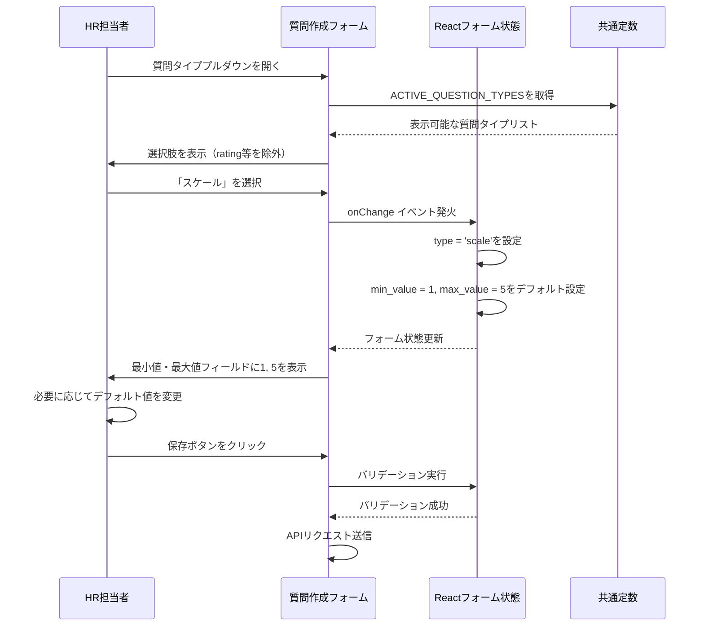
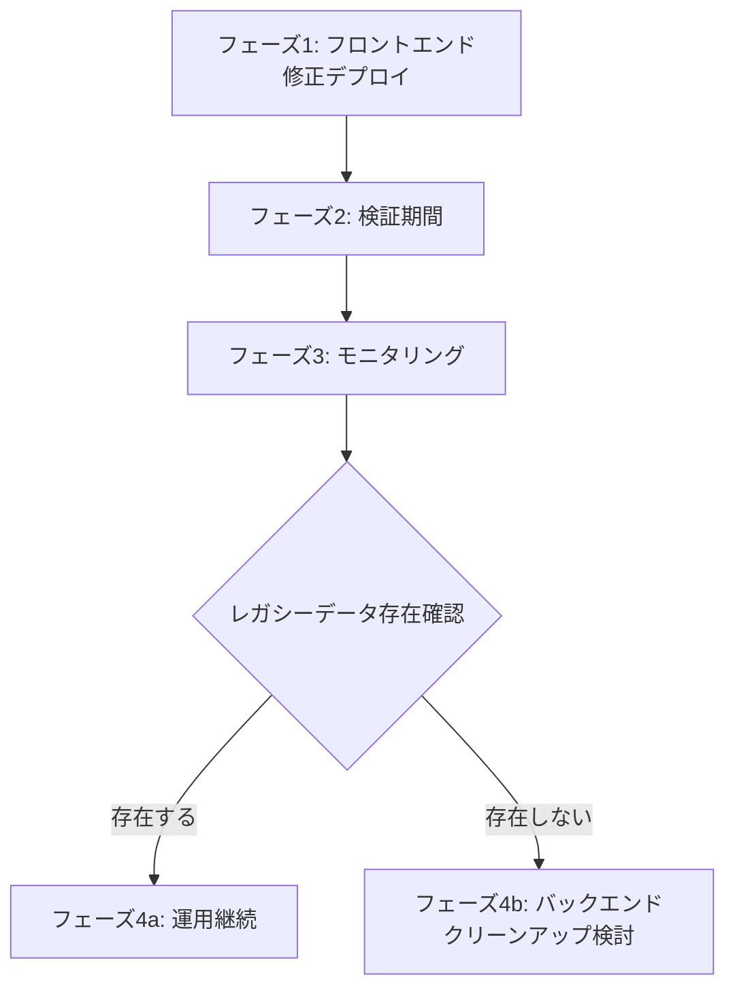

# 技術設計ドキュメント

## 概要

本機能は、質問管理システムにおける質問タイプの整理とユーザーエクスペリエンスの改善を目的とする。不要な質問タイプ（「評価」「評価（5段階）」「評価（10段階）」）をUIから削除し、スケールタイプのデフォルト値を設定し、プルダウンの重複を解消し、表示名の一貫性を確保する。既存データとの完全な後方互換性を維持しながら、HR担当者の質問作成体験を向上させる。

**ユーザー**: HR担当者が質問管理画面および質問割り当て画面で質問を作成・編集・閲覧する際に本機能を利用する。

**影響**: 現在の質問タイプ定義と表示ロジックを変更し、新規質問作成時のバリデーションを強化する。既存の質問データおよび回答データには一切影響を与えない。

### ゴール

- 質問タイプのUIから不要な選択肢を削除し、質問作成時の混乱を防止する
- スケール質問のデフォルト値（最小値1、最大値5）を自動設定し、効率的な質問作成を実現する
- はい/いいえタイプの重複表示を解消し、一貫したUI/UXを提供する
- スケールタイプの表示名を全画面で「スケール」に統一する
- 既存データとの完全な後方互換性を維持する

### 非ゴール

- データベーススキーマの変更（questionsテーブルのtype列は変更しない）
- 既存質問データの削除またはマイグレーション
- 質問タイプの機能的な変更（表示とバリデーションのみ）
- 回答フロー（QuestionForm.tsx）の変更（既存の質問タイプマッピングを維持）

## アーキテクチャ

### 既存アーキテクチャ分析

本システムは3層アーキテクチャ（フロントエンド・バックエンド・データベース）を採用している。質問管理機能は以下のレイヤーで構成される:

- **フロントエンド（React + TypeScript）**: 質問管理画面（QuestionManagement.tsx）、質問割り当て画面（SurveyQuestionAssignment.tsx）、質問バンク（QuestionBank.tsx）
- **バックエンド（Fastify + TypeScript）**: 質問API（questions.routes.ts）、質問サービス（question.service.ts）、質問リポジトリ（question.repository.ts）
- **型定義**: 共通の型定義（backend/src/types/question.types.ts）がZodスキーマでバリデーションを提供

現在の質問タイプ定義:
- **バックエンド**: `QuestionType = z.enum(['text', 'textarea', 'radio', 'checkbox', 'select', 'rating', 'scale', 'boolean'])`
- **フロントエンド**: 各コンポーネントで独自の`QUESTION_TYPES`マッピングを定義（重複と不整合が存在）

### アーキテクチャ統合

**既存パターンの維持**:
- レイヤードアーキテクチャの境界を尊重し、変更は各レイヤー内に局所化する
- Zodスキーマによるバリデーション戦略を継続する
- 型定義の単一情報源（backend/src/types/question.types.ts）を維持する

**新規コンポーネントの根拠**:
- 質問タイプラベルマッピングを一元化する共通定数ファイルを作成（frontend/src/constants/questionTypes.ts）
- 既存の各コンポーネントのローカル定義を共通定数で置き換える

**技術的整合性**:
- React 18 + TypeScript 5の既存スタックを使用
- Zodスキーマバリデーションパターンを継承
- 既存のコンポーネント構造とスタイリング（Tailwind CSS）を維持

**ステアリング準拠**:
- 構造: 既存のディレクトリ構造（frontend/src/pages, frontend/src/components）を維持
- 技術: 既存のReact、TypeScript、Zodスタックを使用
- プロダクト: 完全匿名性とデータ整合性の原則を遵守

### 技術的整合性

本修正は既存の技術スタックとアーキテクチャパターンに完全に整合する:

- **フロントエンド**: 既存のReact 18 + TypeScript 5スタック、Tailwind CSSスタイリング
- **バックエンド**: 既存のFastify + Zodバリデーション戦略
- **新規依存関係**: なし（既存ライブラリのみ使用）

### 主要設計決定

#### 決定1: 質問タイプ表示ラベルの一元化

**決定**: フロントエンドに共通の質問タイプラベルマッピング定数ファイル（`frontend/src/constants/questionTypes.ts`）を作成し、全コンポーネントで共有する。

**コンテキスト**: 現在、QuestionManagement.tsx、SurveyQuestionAssignment.tsx、QuestionBank.tsxの3つのコンポーネントがそれぞれ独自の`QUESTION_TYPES`マッピングを定義しており、表示ラベルの不整合（例: scaleが「スケール」と「評価（10段階）」の両方で表示される）と重複（yes_noとbooleanが両方「はい/いいえ」）が発生している。

**代替案**:
1. 各コンポーネントで個別に修正: 修正漏れのリスクが高く、将来の保守性が低い
2. バックエンドから表示ラベルをAPIで提供: 過剰設計であり、静的な表示文字列のために不要なネットワーク通信が発生
3. 共通定数ファイルで一元管理: シンプルで保守性が高く、TypeScriptの型安全性を活用できる

**選択されたアプローチ**: 共通定数ファイル（`frontend/src/constants/questionTypes.ts`）を作成し、以下を提供する:
- `ACTIVE_QUESTION_TYPES`: UI表示用の質問タイプラベルマッピング（不要なタイプを除外）
- `LEGACY_QUESTION_TYPES`: レガシータイプの表示ラベル（既存データ表示用）
- `getQuestionTypeLabel()`: 全質問タイプに対応する統一ラベル取得関数

**根拠**:
- 単一情報源の原則に従い、表示ラベルの一貫性を保証
- TypeScriptの型システムでコンパイル時に不整合を検出
- 将来の質問タイプ追加・変更が1ファイルの修正で完結
- 既存のアーキテクチャパターン（定数ファイルの使用）に整合

**トレードオフ**:
- 利点: 保守性向上、一貫性保証、型安全性
- 欠点: 新規ファイル追加（ただし小規模で明確な責務）

#### 決定2: バックエンドバリデーションの段階的廃止戦略

**決定**: バックエンドのZodスキーマから`rating`、`rating_5`、`rating_10`を削除せず、新規作成時のみフロントエンドでバリデーションを行う。

**コンテキスト**: 既存のデータベースにはレガシータイプの質問が存在する可能性があり、完全な後方互換性を維持する必要がある。

**代替案**:
1. バックエンドスキーマから即座に削除: 既存データの読み取りが失敗し、システム障害のリスク
2. データマイグレーションでレガシータイプを変換: データ損失リスクと複雑な移行プロセス
3. フロントエンドのみで制御: バックエンドは既存データをサポートし続け、フロントエンドで新規作成を防止

**選択されたアプローチ**: バックエンドのZodスキーマは現状維持し、フロントエンドで以下を実装:
- 質問作成モーダルのプルダウンから不要なタイプを除外
- 既存質問の表示時にはレガシータイプのラベルを表示

**根拠**:
- データ損失リスクを完全に回避
- 既存システムへの影響を最小化
- 段階的な移行を可能にする（将来的なマイグレーション戦略の選択肢を保持）

**トレードオフ**:
- 利点: 安全性、後方互換性、低リスク
- 欠点: バックエンドに一時的にレガシーコードが残る

#### 決定3: スケールタイプのデフォルト値設定戦略

**決定**: 質問タイプ選択時のイベントハンドラーでスケールタイプを検出し、フォーム状態に最小値1、最大値5をデフォルト設定する。

**コンテキスト**: 現在、スケール質問作成時にユーザーが手動で最小値・最大値を入力する必要があり、効率的でない。

**代替案**:
1. サーバーサイドでデフォルト値を設定: バックエンドロジックが複雑化し、フロントエンドとバックエンドの責務が不明確
2. フォーム初期値として設定: 質問タイプ変更時に動的に対応できない
3. onChange イベントハンドラーで動的設定: ユーザーが質問タイプを変更した瞬間にデフォルト値を設定

**選択されたアプローチ**: QuestionManagement.tsx、QuestionBank.tsxの質問タイプ選択onChange ハンドラーで以下を実装:
```typescript
onChange={(e) => {
  const newType = e.target.value;
  setFormData(prev => ({
    ...prev,
    type: newType,
    ...(newType === 'scale' && {
      min_value: prev.min_value ?? 1,
      max_value: prev.max_value ?? 5,
    }),
  }));
}}
```

**根拠**:
- フロントエンドのUI責務に整合（入力支援はUI層の役割）
- ユーザーがデフォルト値を変更可能（柔軟性）
- シンプルで理解しやすい実装
- 既存のフォーム状態管理パターンを踏襲

**トレードオフ**:
- 利点: シンプル、柔軟、UI層に適切
- 欠点: 各コンポーネントで個別実装が必要（ただし共通ロジックとして抽出可能）

## システムフロー

### 質問タイプ選択とデフォルト値設定フロー



## 要件トレーサビリティ

| 要件 | 要件概要 | コンポーネント | インターフェース | フロー |
|------|---------|--------------|----------------|-------|
| 1.1-1.2 | 不要な質問タイプのUI除外 | ACTIVE_QUESTION_TYPES定数、QuestionManagement.tsx、QuestionBank.tsx | プルダウン選択肢生成 | 質問タイプ選択フロー |
| 1.3 | 既存質問の表示と編集 | getQuestionTypeLabel()、LEGACY_QUESTION_TYPES | 質問リスト表示ロジック | 質問一覧表示フロー |
| 1.4 | バックエンドバリデーション | backend/src/types/question.types.ts | QuestionType Zodスキーマ | N/A（現状維持） |
| 2.1-2.2 | スケールデフォルト値設定 | 質問タイプonChangeハンドラー | フォーム状態更新 | 質問タイプ選択とデフォルト値設定フロー |
| 2.3 | デフォルト値の変更保持 | Reactフォーム状態管理 | setFormData | N/A（既存機能） |
| 2.4 | バリデーション強化 | validateForm() | 既存バリデーションロジック | N/A（既存機能） |
| 3.1-3.3 | はい/いいえ重複削除 | ACTIVE_QUESTION_TYPES | プルダウン選択肢（booleanのみ表示） | 質問タイプ選択フロー |
| 4.1-4.4 | スケール表示名統一 | getQuestionTypeLabel()、ACTIVE_QUESTION_TYPES | 全画面の質問タイプ表示 | 質問一覧表示フロー |
| 5.1-5.4 | 後方互換性保持 | LEGACY_QUESTION_TYPES、getQuestionTypeLabel() | 既存質問表示ロジック | 質問一覧表示フロー |

## コンポーネントとインターフェース

### フロントエンド層

#### 共通定数（frontend/src/constants/questionTypes.ts）

**責務と境界**
- **主要責務**: 質問タイプの表示ラベルマッピングを一元管理し、全コンポーネントに一貫した表示文字列を提供する
- **ドメイン境界**: UIプレゼンテーション層（表示ロジックのみ、ビジネスロジックは含まない）
- **データ所有権**: 質問タイプの表示文字列定義（読み取り専用）

**依存関係**
- **インバウンド**: QuestionManagement.tsx、SurveyQuestionAssignment.tsx、QuestionBank.tsx
- **アウトバウンド**: なし（純粋な定数定義）

**契約定義**

```typescript
// アクティブな質問タイプ（UI表示用）
export const ACTIVE_QUESTION_TYPES = {
  text: 'テキスト（短文）',
  textarea: 'テキスト（長文）',
  radio: '単一選択',
  checkbox: '複数選択',
  select: 'プルダウン',
  scale: 'スケール',
  boolean: 'はい/いいえ',
} as const;

// レガシー質問タイプ（既存データ表示用）
export const LEGACY_QUESTION_TYPES = {
  rating: '評価（レガシー）',
  rating_5: '評価（5段階・レガシー）',
  rating_10: '評価（10段階・レガシー）',
  yes_no: 'はい/いいえ',
} as const;

// 全質問タイプの統一ラベル取得関数
export function getQuestionTypeLabel(type: string): string;
```

**事前条件**: なし（純粋関数）
**事後条件**: 有効な質問タイプに対して対応する日本語ラベルを返す
**不変条件**: 定数オブジェクトは変更不可（as const）

#### QuestionManagement.tsx

**責務と境界**
- **主要責務**: HR担当者が質問を作成・編集・削除・検索するためのメイン管理画面
- **ドメイン境界**: 質問管理UI層
- **データ所有権**: ページ内のローカル状態（フォームデータ、検索フィルター、モーダル表示状態）

**依存関係**
- **インバウンド**: Reactルーター（/admin/questions）
- **アウトバウンド**: questionService（API呼び出し）、共通定数（questionTypes.ts）、UIコンポーネント

**変更内容**

```typescript
// 修正前
const QUESTION_TYPES = {
  // ...
  rating: '評価',
  rating_5: '評価（5段階）',
  rating_10: '評価（10段階）',
  scale: 'スケール',
  yes_no: 'はい/いいえ',
  boolean: 'はい/いいえ',
} as const;

// 修正後
import { ACTIVE_QUESTION_TYPES, getQuestionTypeLabel } from '@/constants/questionTypes';

// プルダウンレンダリング
{Object.entries(ACTIVE_QUESTION_TYPES).map(([key, label]) => (
  <option key={key} value={key}>{label}</option>
))}

// 質問タイプ選択時のデフォルト値設定
onChange={(e) => {
  const newType = e.target.value as keyof typeof ACTIVE_QUESTION_TYPES;
  setFormData(prev => ({
    ...prev,
    type: newType,
    ...(newType === 'scale' && {
      min_value: prev.min_value ?? 1,
      max_value: prev.max_value ?? 5,
    }),
  }));
}}

// 既存質問の表示ラベル
<span className="px-2 py-1 text-xs font-medium bg-gray-100 text-gray-800 rounded">
  {getQuestionTypeLabel(question.type)}
</span>
```

#### SurveyQuestionAssignment.tsx

**責務と境界**
- **主要責務**: 調査に質問を割り当て、順序を設定する画面
- **ドメイン境界**: 調査質問割り当てUI層
- **データ所有権**: 割り当て済み質問リスト、利用可能な質問リスト、ドラッグアンドドロップ状態

**依存関係**
- **インバウンド**: Reactルーター（/admin/surveys/:surveyId/questions）
- **アウトバウンド**: SurveyQuestionService（API呼び出し）、共通定数（questionTypes.ts）

**変更内容**

```typescript
// 修正前
const QUESTION_TYPES = {
  // ...
  rating: '評価',
  rating_5: '評価（5段階）',
  rating_10: '評価（10段階）',
  scale: 'スケール',
  yes_no: 'はい/いいえ',
} as const;

// 修正後
import { getQuestionTypeLabel } from '@/constants/questionTypes';

// 質問タイプ表示
<span className="px-2 py-1 text-xs font-medium bg-gray-100 text-gray-800 rounded">
  {getQuestionTypeLabel(question.type)}
</span>
```

#### QuestionBank.tsx

**責務と境界**
- **主要責務**: 質問バンクの表示と質問選択機能（モーダル内で使用）
- **ドメイン境界**: 質問バンクUI層
- **データ所有権**: 質問リスト、フィルター状態、フォーム状態

**依存関係**
- **インバウンド**: 親コンポーネント（AdminDashboard等）
- **アウトバウンド**: 共通定数（questionTypes.ts）、UIコンポーネント

**変更内容**

```typescript
// 修正前
const QUESTION_TYPES = {
  // ...
  rating: '評価',
  scale: 'スケール',
  boolean: 'はい/いいえ',
} as const;

// 修正後
import { ACTIVE_QUESTION_TYPES, getQuestionTypeLabel } from '@/constants/questionTypes';

// プルダウンレンダリング
{Object.entries(ACTIVE_QUESTION_TYPES).map(([key, label]) => (
  <option key={key} value={key}>{label}</option>
))}

// 質問タイプ選択時のデフォルト値設定
onChange={(e) => {
  const newType = e.target.value as QuestionType;
  setFormData(prev => ({
    ...prev,
    type: newType,
    ...(newType === 'scale' && {
      min_value: prev.min_value ?? 1,
      max_value: prev.max_value ?? 5,
    }),
  }));
}}

// 既存質問の表示ラベル
<span className="px-2 py-1 text-xs font-medium bg-gray-100 text-gray-800 rounded">
  {getQuestionTypeLabel(question.type)}
</span>
```

### バックエンド層

#### backend/src/types/question.types.ts

**責務と境界**
- **主要責務**: 質問関連のZodスキーマと型定義を提供
- **ドメイン境界**: 質問ドメインの型安全性
- **データ所有権**: 質問型定義（コンパイル時の型安全性）

**依存関係**
- **インバウンド**: questions.routes.ts、question.service.ts、question.repository.ts
- **アウトバウンド**: Zodライブラリ

**変更内容**

```typescript
// 現状維持（後方互換性のため変更なし）
export const QuestionType = z.enum([
  'text',
  'textarea',
  'radio',
  'checkbox',
  'select',
  'rating',      // レガシー（既存データサポート）
  'scale',
  'boolean',
]);
```

**注記**: バックエンドスキーマは変更せず、フロントエンドで新規作成を制御する戦略を採用。将来的にレガシータイプの削除が必要な場合は、データマイグレーション戦略と併せて実施する。

## データモデル

### 論理データモデル

本修正はデータモデルの変更を伴わない。既存のquestionsテーブルスキーマを維持する:

```sql
CREATE TABLE questions (
  id SERIAL PRIMARY KEY,
  question VARCHAR(1000) NOT NULL,
  type VARCHAR(50) NOT NULL,  -- 'text', 'textarea', 'radio', 'checkbox', 'select', 'rating', 'scale', 'boolean'
  category VARCHAR(100),
  is_required BOOLEAN DEFAULT FALSE,
  options TEXT[],
  min_value INTEGER,
  max_value INTEGER,
  min_label VARCHAR(100),
  max_label VARCHAR(100),
  created_at TIMESTAMP DEFAULT CURRENT_TIMESTAMP,
  updated_at TIMESTAMP DEFAULT CURRENT_TIMESTAMP
);
```

**変更なし**: type列は既存のすべての質問タイプ値（レガシーを含む）を引き続きサポートする。

**データ整合性**:
- 既存の`rating`、`rating_5`、`rating_10`タイプの質問データは保持される
- 新規作成される質問はフロントエンドのバリデーションにより`rating`、`rating_5`、`rating_10`を使用しない
- `scale`タイプの新規質問は最小値1、最大値5のデフォルト値を持つ（ユーザー変更可能）

## エラーハンドリング

### エラー戦略

既存のエラーハンドリング機構を維持し、以下のエラーケースに対応する:

### エラーカテゴリと対応

**ユーザーエラー（4xx）**:
- **無効な質問タイプ選択**: フロントエンドのプルダウンで不要なタイプを非表示にすることで防止（予防的エラーハンドリング）
- **バリデーションエラー**: 既存のvalidateForm()ロジックを維持
  - スケールタイプで最小値 >= 最大値の場合: "最大値は最小値より大きく設定してください"
  - 必須フィールド未入力: "質問文は必須です"

**システムエラー（5xx）**:
- **API通信失敗**: 既存のtry-catchブロックでキャッチし、ユーザーフレンドリーなメッセージを表示
- **予期しないサーバーエラー**: "保存に失敗しました。入力内容を確認してください。"

**ビジネスロジックエラー（422）**:
- 本修正では新規ビジネスロジックエラーは発生しない（既存のバリデーションロジックを維持）

### モニタリング

既存のエラーロギング機構を維持:
- フロントエンド: `console.error()`でクライアントサイドエラーを記録
- バックエンド: Pinoロガーでサーバーサイドエラーを記録

## テスト戦略

### ユニットテスト

**共通定数（questionTypes.ts）**:
1. `getQuestionTypeLabel()`が既知の質問タイプに対して正しいラベルを返すことを検証
2. `getQuestionTypeLabel()`が未知の質問タイプに対してフォールバックラベルを返すことを検証
3. `ACTIVE_QUESTION_TYPES`が期待される質問タイプのみを含むことを検証（ratingを除外）

**QuestionManagement.tsx**:
1. 質問タイププルダウンに不要なタイプ（rating, rating_5, rating_10）が表示されないことを検証
2. スケールタイプ選択時に最小値1、最大値5がデフォルト設定されることを検証
3. 既存質問の表示時に正しいラベル（レガシータイプ含む）が表示されることを検証

**QuestionBank.tsx**:
1. 質問タイププルダウンに「はい/いいえ」が1つのみ表示されることを検証
2. スケールタイプ選択時にデフォルト値が設定されることを検証

### 統合テスト

1. 質問作成フロー: 質問管理画面でスケール質問を作成し、デフォルト値が正しく保存されることを検証
2. 質問編集フロー: 既存のレガシータイプ質問を編集し、正しく表示・保存されることを検証
3. 質問割り当てフロー: 質問割り当て画面で質問タイプラベルが統一されていることを検証

### E2Eテスト

1. **質問作成シナリオ**:
   - 質問管理画面にアクセス
   - 「新しい質問を作成」をクリック
   - 質問タイププルダウンに「評価」「評価（5段階）」「評価（10段階）」が表示されないことを確認
   - 「スケール」を選択し、最小値・最大値フィールドに1, 5が自動設定されることを確認
   - 質問を保存し、成功メッセージが表示されることを確認

2. **既存質問表示シナリオ**:
   - データベースにレガシータイプの質問を準備
   - 質問管理画面で既存質問リストを表示
   - レガシータイプの質問が適切なラベルで表示されることを確認
   - レガシータイプの質問を編集可能であることを確認

3. **質問割り当てシナリオ**:
   - 質問割り当て画面にアクセス
   - 利用可能な質問リストでスケールタイプが「スケール」と表示されることを確認
   - 割り当て済み質問リストでも一貫したラベルが表示されることを確認

## セキュリティ考慮事項

本修正はセキュリティに直接影響しない。既存のセキュリティ機構を維持する:

- **入力バリデーション**: Zodスキーマによるサーバーサイドバリデーションを継続
- **SQLインジェクション対策**: パラメータ化クエリを継続使用
- **XSS対策**: Reactのデフォルトエスケープ機能を継続使用

## 移行戦略

本修正はデータ移行を伴わない段階的移行戦略を採用する:



**フェーズ1: フロントエンド修正デプロイ**:
- 共通定数ファイル作成
- QuestionManagement.tsx、QuestionBank.tsx修正
- SurveyQuestionAssignment.tsx修正
- E2Eテスト実行

**フェーズ2: 検証期間（1-2週間）**:
- HR担当者による新規質問作成の動作確認
- 既存質問の表示・編集の動作確認
- エラーログの監視

**フェーズ3: モニタリング（継続的）**:
- 質問タイプ使用状況の分析
- レガシータイプの新規作成がないことの確認

**フェーズ4a: 運用継続**:
- レガシーデータが存在する場合、現状の後方互換性戦略を継続

**フェーズ4b: バックエンドクリーンアップ検討（オプション）**:
- レガシーデータが存在しない場合、将来的にバックエンドスキーマからレガシータイプを削除可能
- データマイグレーション戦略の策定が必要な場合に検討

**ロールバックトリガー**:
- E2Eテスト失敗
- 既存質問の表示エラー
- 質問作成・編集の重大なバグ

**検証チェックポイント**:
- 新規質問作成で不要なタイプが選択できない
- スケール質問のデフォルト値が正しく設定される
- 既存質問が正しく表示・編集できる
- 質問割り当て画面で一貫したラベルが表示される
