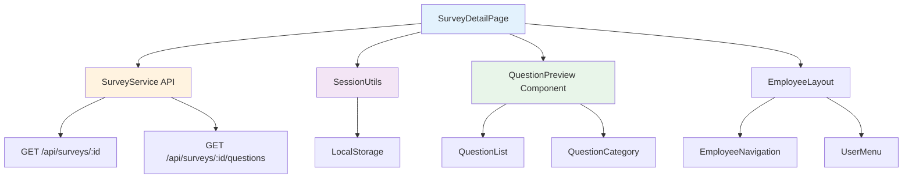
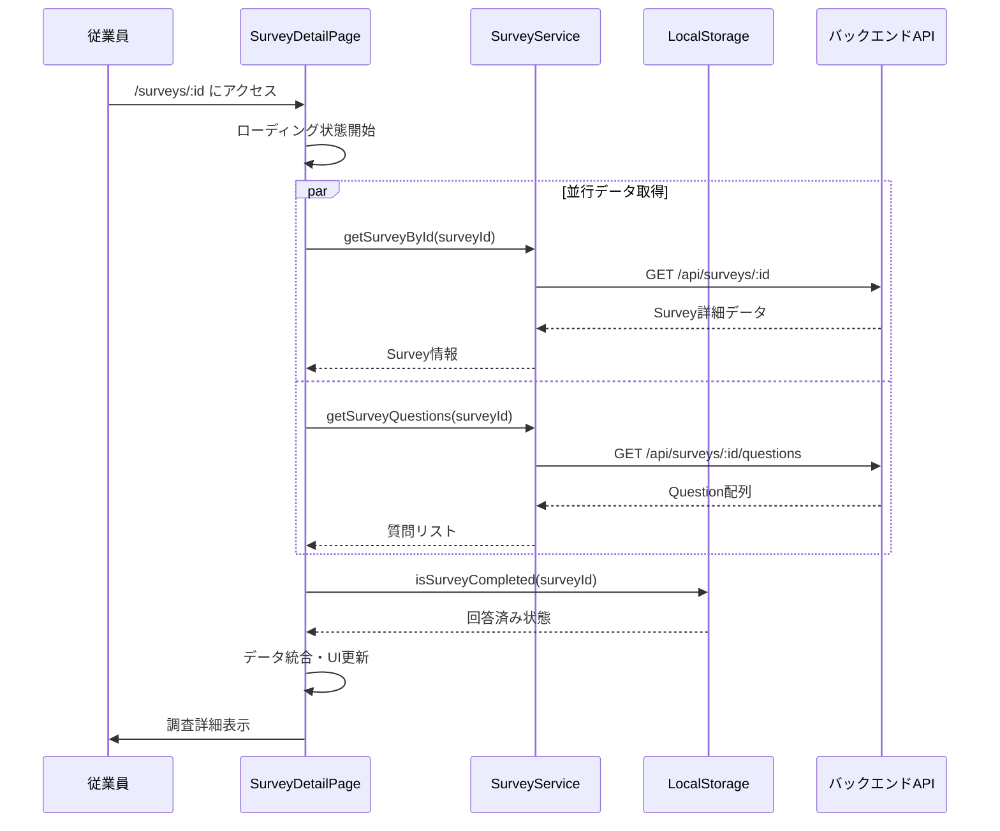
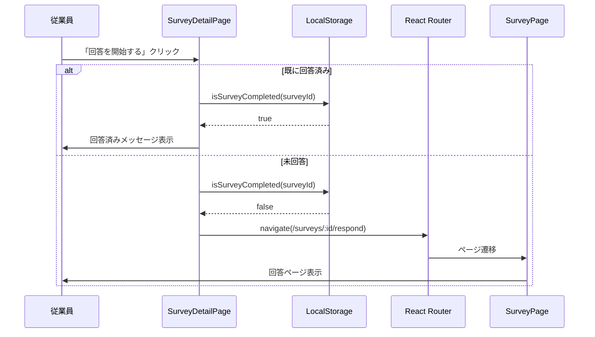
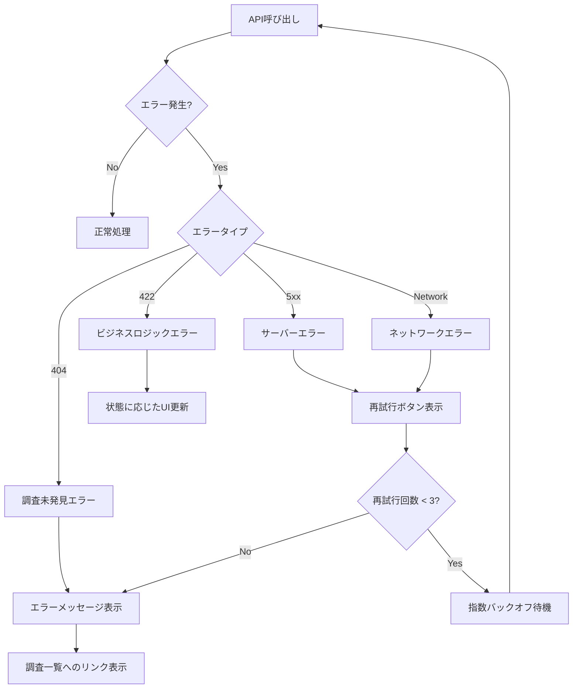

# 技術設計書

## 概要

調査詳細参照機能は、従業員が公開中の組織サーベイの詳細情報を閲覧し、回答を開始できる機能を提供します。既存のSurveyDetailPageコンポーネントを拡張し、質問プレビュー機能と回答状態管理機能を追加することで、従業員の調査理解度を向上させ、より質の高い回答を促進します。

**目的**: 従業員が調査の全体像を把握してから回答を開始できるようにすることで、回答品質とエンゲージメントを向上させる。

**対象ユーザー**: 一般従業員が主要ユーザーとなり、調査一覧から詳細ページに遷移し、質問内容を確認した上で回答を開始する。

**既存システムへの影響**: 現在のSurveyDetailPageは基本情報のみを表示しているため、質問プレビュー機能と回答状態表示機能を追加する形で拡張する。

### ゴール

- 調査の詳細情報（タイトル、説明、期限、推定所要時間）を明確に表示
- 質問内容のプレビュー機能により、回答前に全体像を把握可能
- LocalStorageベースの回答状態管理により、重複回答を防止
- 完全匿名性を維持しながら、個別の回答状態を追跡

### 非ゴール

- 質問の編集機能（管理者機能のため対象外）
- 回答の下書き保存機能（将来検討、現フェーズでは対象外）
- 部分回答の再開機能（将来検討）
- 調査結果の閲覧機能（別機能として実装予定）

## アーキテクチャ

### 既存アーキテクチャ分析

現在のSurveyDetailPageは以下の構造を持つ：

- **ページコンポーネント**: `frontend/src/pages/SurveyDetailPage.tsx`
- **APIサービス**: `SurveyService.getSurveyById()` および `SurveyService.getSurveyQuestions()`
- **レイアウト**: `EmployeeLayout` コンポーネントを使用
- **状態管理**: ローカルstate（useState）でloading、error、surveyデータを管理
- **ナビゲーション**: React Routerによるルーティング（`/surveys/:surveyId`）

**既存パターンの保持**:
- EmployeeLayoutによる統一されたレイアウト
- SurveyServiceを通じたAPI通信
- エラーハンドリングとローディング状態の表示パターン
- Tailwind CSSによるスタイリング

**拡張が必要な領域**:
- 質問データの取得と表示ロジック
- LocalStorageベースの回答状態管理
- 質問リストの折りたたみ表示（10問超過時）

### 高レベルアーキテクチャ



### 技術スタック整合性

既存の技術スタックに完全に準拠：

**フロントエンド技術**:
- React 18.2.0 + TypeScript 5.3.3
- React Router DOM 6.20.1（既存ルーティング）
- Tailwind CSS 3.4.0（既存スタイリング）
- Vite 5.0.10（ビルドツール）

**状態管理**:
- ローカルstate（useState）- 既存パターンに準拠
- React Query（将来的な最適化候補）

**バリデーション**:
- Zod 3.22.4 - APIレスポンスの検証に使用

**新規依存関係**: なし（既存ライブラリのみを使用）

### 主要設計決定

#### 決定1: 質問プレビューコンポーネントの分離

**決定**: 質問プレビュー機能を独立したコンポーネント（QuestionPreviewList）として実装

**コンテキスト**: SurveyDetailPageは現在、調査の基本情報のみを表示しており、質問情報の表示機能がない。質問リストは複雑なロジック（カテゴリ分類、折りたたみ表示、質問タイプ別表示）を含むため、コンポーネント分離が必要。

**代替案**:
1. SurveyDetailPage内に直接実装（モノリシックアプローチ）
2. 質問ごとに個別コンポーネント化（QuestionItem、QuestionCategory等）
3. 独立したQuestionPreviewListコンポーネント（選択）

**選択アプローチ**: QuestionPreviewListコンポーネント
- 質問リスト全体を管理する単一コンポーネント
- 内部で質問タイプ別の表示ロジックを処理
- カテゴリ分類と折りたたみ機能を含む

**根拠**:
- 単一責任原則: 質問プレビュー表示のみに特化
- 再利用性: 他のページ（管理者プレビュー等）でも使用可能
- テスト容易性: 独立したコンポーネントとして単体テスト可能
- 既存パターン準拠: 他のコンポーネント（EmployeeLayout、SurveyCard等）と同様の構造

**トレードオフ**:
- ✅ 獲得: コンポーネント再利用性、テスト容易性、保守性向上
- ❌ 犠牲: 若干のコンポーネント数増加（1コンポーネント追加）

#### 決定2: LocalStorageベースの回答状態管理

**決定**: 既存のsession.tsユーティリティを拡張して回答状態を管理

**コンテキスト**: 完全匿名性を維持しながら重複回答を防止する必要がある。既にsession.tsでLocalStorageベースのセッション管理が実装されている。

**代替案**:
1. バックエンドDBでセッションIDベースの回答状態管理
2. Cookieベースの状態管理
3. LocalStorage + 既存session.tsの拡張（選択）

**選択アプローチ**: LocalStorage + session.ts拡張
- `getCompletedSurveys()`: 完了済み調査IDリストを取得
- `markSurveyCompleted()`: 調査完了をマーク
- `isSurveyCompleted()`: 完了状態をチェック

**根拠**:
- 完全匿名性維持: 個人情報をバックエンドに保存しない
- 既存パターン準拠: session.tsの既存機能と統合
- シンプル性: 追加のAPI実装不要
- デバイス単位の管理: ブラウザLocalStorageで自然に実現

**トレードオフ**:
- ✅ 獲得: 完全匿名性、実装の簡素化、既存インフラ活用
- ❌ 犠牲: デバイス間での回答状態同期不可（仕様上許容）

#### 決定3: 段階的な機能拡張アプローチ

**決定**: 既存SurveyDetailPageを最小限の変更で拡張

**コンテキスト**: SurveyDetailPageは既に稼働中のコンポーネントであり、既存機能を壊さずに新機能を追加する必要がある。

**代替案**:
1. 完全な書き直し（リスク高）
2. 既存コードの段階的拡張（選択）
3. 新しいページコンポーネントの作成（二重管理リスク）

**選択アプローチ**: 既存コンポーネントの段階的拡張
- 既存のAPI呼び出しロジックを保持
- 質問データ取得ロジックを追加（`getSurveyQuestions`）
- 回答状態チェックロジックを追加（LocalStorage）
- UIセクションを追加（質問プレビュー、回答状態表示）

**根拠**:
- リスク最小化: 既存機能への影響を最小限に抑制
- 段階的移行: 既存パターンを尊重しながら改善
- テスト容易性: 新機能を個別にテスト可能

**トレードオフ**:
- ✅ 獲得: 既存機能の安定性、段階的なテスト、低リスク
- ❌ 犠牲: コンポーネントの責務がやや増加（許容範囲内）

## システムフロー

### ページ表示フロー



### 回答開始フロー



## 要件トレーサビリティ

| 要件 | 要件概要 | コンポーネント | インターフェース | フロー |
|------|----------|--------------|----------------|--------|
| 1.1 | 調査タイトル表示 | SurveyDetailPage | SurveyService.getSurveyById | ページ表示フロー |
| 1.2 | 調査説明文表示 | SurveyDetailPage | Survey.description | ページ表示フロー |
| 1.3 | 公開期間・期限表示 | SurveyDetailPage | Survey.start_date, end_date | ページ表示フロー |
| 1.4 | 推定所要時間表示 | SurveyDetailPage | 質問数 × 平均時間 | ページ表示フロー |
| 1.5 | 期限強調表示 | SurveyDetailPage | 日付計算ロジック | ページ表示フロー |
| 2.1 | 質問リスト表示 | QuestionPreviewList | SurveyService.getSurveyQuestions | ページ表示フロー |
| 2.2 | 質問詳細表示 | QuestionPreviewList | Question型定義 | ページ表示フロー |
| 2.3 | カテゴリ分類表示 | QuestionPreviewList | Question.category | ページ表示フロー |
| 2.4 | 選択肢表示 | QuestionPreviewList | Question.options | ページ表示フロー |
| 2.5 | 折りたたみ表示 | QuestionPreviewList | 状態管理（useState） | ページ表示フロー |
| 3.1 | 回答状態表示 | SurveyDetailPage | SessionUtils.isSurveyCompleted | ページ表示フロー |
| 3.2 | 回答完了日時表示 | SurveyDetailPage | LocalStorage完了情報 | ページ表示フロー |
| 3.3 | 回答開始ボタン表示 | SurveyDetailPage | 条件付きレンダリング | ページ表示フロー |
| 3.4 | 回答済みステータス表示 | SurveyDetailPage | 条件付きレンダリング | ページ表示フロー |
| 4.1-4.4 | 回答ページ遷移 | SurveyDetailPage | React Router navigate | 回答開始フロー |
| 5.1-5.5 | ナビゲーション | SurveyDetailPage, EmployeeLayout | React Router Link | ページ表示フロー |
| 6.1-6.5 | レスポンシブ・アクセシビリティ | 全コンポーネント | Tailwind CSS, ARIA | 全フロー |
| 7.1-7.5 | パフォーマンス・エラー処理 | SurveyDetailPage | try-catch, ローディング状態 | 全フロー |
| 8.1-8.5 | データ取得・検証 | SurveyService | Zod validation | ページ表示フロー |

## コンポーネントとインターフェース

### プレゼンテーション層

#### SurveyDetailPage（拡張）

**責務と境界**
- **主要責務**: 調査詳細情報の表示、質問プレビュー表示、回答開始制御
- **ドメイン境界**: 従業員向け調査参照機能
- **データ所有**: ページレベルの表示状態（loading, error, survey, questions）
- **トランザクション境界**: なし（読み取り専用）

**依存関係**
- **インバウンド**: React Router（URLパラメータ）
- **アウトバウンド**: SurveyService（API通信）、SessionUtils（状態管理）、QuestionPreviewList（質問表示）
- **外部**: React、React Router、Tailwind CSS

**コントラクト定義**

**コンポーネントProps**:
```typescript
interface SurveyDetailPageProps {
  // Propsなし（URLパラメータから取得）
}
```

**内部状態**:
```typescript
interface SurveyDetailState {
  survey: Survey | null;
  questions: Question[];
  loading: boolean;
  error: string | null;
  isCompleted: boolean;
}
```

**主要メソッド**:
- `loadSurveyDetails()`: 調査データと質問データを並行取得
- `checkCompletionStatus()`: LocalStorageから回答状態を確認
- `handleStartSurvey()`: 回答ページへ遷移
- `calculateEstimatedTime(questionCount)`: 推定所要時間を計算

**事前条件**:
- URLパラメータにsurveyIdが存在する
- SurveyServiceが利用可能

**事後条件**:
- 調査詳細と質問リストが表示される
- 回答状態に基づいて適切なUIが表示される

**不変条件**:
- loadingとerrorは相互排他的
- surveyがnullの場合、questionsも空配列

#### QuestionPreviewList（新規）

**責務と境界**
- **主要責務**: 質問リストの表示、カテゴリ分類、折りたたみ制御
- **ドメイン境界**: 質問プレビュー表示
- **データ所有**: 折りたたみ状態（展開/折りたたみ）
- **トランザクション境界**: なし（表示のみ）

**依存関係**
- **インバウンド**: SurveyDetailPage
- **アウトバウンド**: なし
- **外部**: React、Tailwind CSS

**コントラクト定義**

**コンポーネントProps**:
```typescript
interface QuestionPreviewListProps {
  questions: Question[];
  collapsible?: boolean; // 10問超過時のデフォルト動作
}
```

**内部状態**:
```typescript
interface QuestionPreviewState {
  expandedCategories: Set<string>; // 展開中のカテゴリ
  isExpanded: boolean; // 全体の展開状態
}
```

**主要メソッド**:
- `groupByCategory(questions)`: カテゴリごとに質問をグループ化
- `toggleCategory(category)`: カテゴリの展開/折りたたみ
- `toggleAll()`: 全カテゴリの展開/折りたたみ
- `renderQuestionType(question)`: 質問タイプに応じた表示

**事前条件**:
- questions配列が提供される（空配列も許可）

**事後条件**:
- 質問がカテゴリ別に整理されて表示される
- 10問超過時は折りたたみ可能な状態で表示

### API通信層

#### SurveyService（既存 + 拡張）

**責務と境界**
- **主要責務**: 調査および質問データのCRUD操作
- **ドメイン境界**: Survey APIとのインターフェース
- **データ所有**: APIレスポンスのキャッシュ（なし、将来React Queryで実装）

**依存関係**
- **インバウンド**: SurveyDetailPage、他の調査関連ページ
- **アウトバウンド**: apiClient（Axiosインスタンス）
- **外部**: Axios、バックエンドAPI

**APIコントラクト**:

| メソッド | エンドポイント | リクエスト | レスポンス | エラー |
|---------|--------------|-----------|----------|--------|
| getSurveyById | GET /api/surveys/:id | surveyId: string | ApiResponse<Survey> | 404, 500 |
| getSurveyQuestions | GET /api/surveys/:id/questions | surveyId: string | ApiResponse<Question[]> | 404, 500 |

**レスポンススキーマ（Zod）**:
```typescript
const SurveySchema = z.object({
  id: z.string(),
  title: z.string(),
  description: z.string().nullable(),
  status: z.enum(['draft', 'active', 'closed', 'archived']),
  start_date: z.string(),
  end_date: z.string(),
  created_at: z.string(),
  updated_at: z.string(),
  questionCount: z.number().optional(),
});

const QuestionSchema = z.object({
  id: z.string(),
  type: z.enum(['multiple_choice', 'rating', 'scale', 'text', 'yes_no']),
  question: z.string(),
  options: z.array(z.string()).optional(),
  required: z.boolean(),
  category: z.string(),
  order: z.number().optional(),
});
```

**事前条件**:
- surveyIdが有効なUUID形式
- バックエンドAPIが利用可能

**事後条件**:
- 成功時: 検証済みのSurveyまたはQuestion[]を返す
- 失敗時: エラーをthrow

### ユーティリティ層

#### SessionUtils（拡張）

**責務と境界**
- **主要責務**: 匿名セッション管理、回答状態管理
- **ドメイン境界**: ブラウザLocalStorage操作
- **データ所有**: セッション情報、完了済み調査リスト

**依存関係**
- **インバウンド**: SurveyDetailPage、SurveyPage
- **アウトバウンド**: LocalStorage API
- **外部**: ブラウザWeb Storage API

**コントラクト定義**:

```typescript
// 新規追加メソッド
interface SessionUtilsExtension {
  // 完了済み調査の管理
  isSurveyCompleted(surveyId: string): boolean;
  markSurveyCompleted(surveyId: string, completedAt: string): void;
  getCompletedSurveys(): CompletedSurvey[];

  // 完了情報の取得
  getSurveyCompletionInfo(surveyId: string): CompletionInfo | null;
}

interface CompletedSurvey {
  surveyId: string;
  completedAt: string;
  sessionId: string;
}

interface CompletionInfo {
  surveyId: string;
  completedAt: string;
  sessionId: string;
}
```

**LocalStorageキー**:
- `completed_surveys`: 完了済み調査のリスト（JSON配列）
- `survey_completion_${surveyId}`: 個別調査の完了情報

**事前条件**:
- LocalStorageが利用可能
- surveyIdが有効な文字列

**事後条件**:
- 完了状態が正確にLocalStorageに保存される
- 完了情報が取得可能

**不変条件**:
- 完了済み調査リストは重複を含まない
- completedAtはISO 8601形式の日時文字列

## データモデル

### 論理データモデル

#### Survey（既存）

調査の基本情報を表すドメインモデル。

```typescript
interface Survey {
  id: string;                    // 調査ID（UUID）
  title: string;                 // 調査タイトル
  description: string | null;    // 調査説明
  status: SurveyStatus;          // 調査ステータス
  start_date: string;            // 開始日（ISO 8601）
  end_date: string;              // 終了日（ISO 8601）
  created_at: string;            // 作成日時（ISO 8601）
  updated_at: string;            // 更新日時（ISO 8601）
  questionCount?: number;        // 質問数（オプション）
}

type SurveyStatus = 'draft' | 'active' | 'closed' | 'archived';
```

**ビジネスルール**:
- `start_date` < `end_date` でなければならない
- `status === 'active'` の場合のみ回答可能
- `questionCount` は関連する質問数と一致する必要がある

#### Question（既存）

調査に含まれる質問を表すドメインモデル。

```typescript
interface Question {
  id: string;                              // 質問ID（UUID）
  type: QuestionType;                      // 質問タイプ
  question: string;                        // 質問文
  options?: string[];                      // 選択肢（多肢選択時）
  required: boolean;                       // 必須フラグ
  category: string;                        // カテゴリ（A-G）
  order?: number;                          // 表示順序
}

type QuestionType =
  | 'multiple_choice'  // 多肢選択
  | 'rating'           // 評価式（星評価等）
  | 'scale'            // 評価スケール（1-5等）
  | 'text'             // 自由記述
  | 'yes_no';          // Yes/No
```

**ビジネスルール**:
- `type === 'multiple_choice'` の場合、`options` が必須
- `category` は 'A' から 'G' のいずれか
- `order` が設定されている場合、同一調査内で重複不可

#### CompletedSurvey（新規）

完了済み調査の情報を管理するモデル（LocalStorage用）。

```typescript
interface CompletedSurvey {
  surveyId: string;        // 調査ID
  completedAt: string;     // 完了日時（ISO 8601）
  sessionId: string;       // セッションID
}
```

**ビジネスルール**:
- `surveyId` は一意（重複不可）
- `completedAt` は過去の日時
- `sessionId` はUUID形式

### データコントラクト

#### APIレスポンス型

```typescript
interface ApiResponse<T> {
  data: T;
  message?: string;
  success: boolean;
}

interface PaginatedResponse<T> extends ApiResponse<T[]> {
  total: number;
  page: number;
  pageSize: number;
}
```

#### LocalStorageスキーマ

**completed_surveys**:
```json
[
  {
    "surveyId": "uuid-string",
    "completedAt": "2025-10-06T15:30:00+09:00",
    "sessionId": "uuid-string"
  }
]
```

**survey_completion_{surveyId}**:
```json
{
  "surveyId": "uuid-string",
  "completedAt": "2025-10-06T15:30:00+09:00",
  "sessionId": "uuid-string",
  "submittedAt": "2025-10-06T15:30:00+09:00"
}
```

## エラーハンドリング

### エラー戦略

調査詳細参照機能では、3層のエラーハンドリング戦略を採用：

1. **API層**: Axiosインターセプターによる統一エラー処理
2. **サービス層**: try-catchによるエラーキャッチとログ記録
3. **UI層**: ユーザーフレンドリーなエラーメッセージとリカバリーオプション

### エラーカテゴリと対応

#### ユーザーエラー（4xx）

**404 Not Found - 調査が見つからない**
- **検出**: `SurveyService.getSurveyById()` が404を返す
- **表示**: 「調査が見つかりませんでした」メッセージ
- **アクション**: 「調査一覧に戻る」ボタン表示
- **コード例**:
```typescript
if (error.response?.status === 404) {
  setError('調査が見つかりませんでした。削除されたか、URLが正しくない可能性があります。');
}
```

**400 Bad Request - 無効なリクエスト**
- **検出**: APIリクエストパラメータが不正
- **表示**: 「リクエストが無効です」メッセージ
- **アクション**: 自動的に調査一覧にリダイレクト

#### システムエラー（5xx）

**500 Internal Server Error - サーバーエラー**
- **検出**: バックエンドAPIが500エラーを返す
- **表示**: 「サーバーエラーが発生しました」メッセージ
- **アクション**: 「再試行」ボタンと「調査一覧に戻る」ボタン表示
- **リカバリー**: 自動リトライ（最大3回、指数バックオフ）

**503 Service Unavailable - サービス利用不可**
- **検出**: バックエンドが一時的に利用不可
- **表示**: 「サービスが一時的に利用できません」メッセージ
- **アクション**: 「再試行」ボタンと待機時間の表示

**ネットワークエラー**
- **検出**: `error.message === 'Network Error'`
- **表示**: 「ネットワークエラー。インターネット接続を確認してください。」
- **アクション**: 「再試行」ボタン

#### ビジネスロジックエラー（422）

**調査が非公開状態**
- **検出**: `survey.status !== 'active'`
- **表示**: 「この調査は現在公開されていません」メッセージ
- **UI**: 回答開始ボタンを無効化

**調査期限切れ**
- **検出**: `new Date(survey.end_date) < new Date()`
- **表示**: 「この調査は終了しました」メッセージ
- **UI**: 回答開始ボタンを無効化、期限切れバッジ表示

### エラーフロー図



### モニタリング

**エラーログ記録**:
- エラー発生時に`console.error()`でログ出力
- エラー内容: タイムスタンプ、エラータイプ、スタックトレース、ユーザーコンテキスト
- 将来的には外部ログサービス（Sentry等）への送信を検討

**ヘルスチェック**:
- ページロード時のAPI応答時間を計測
- 2秒以内の表示を目標（要件7.1）

## テスティング戦略

### ユニットテスト

**SurveyDetailPage コンポーネント**:
1. 調査データの正常表示（基本情報、期限、説明）
2. 質問リストの正常表示
3. 回答済み状態の正確な表示
4. 未回答状態での「回答を開始する」ボタン表示
5. ローディング状態の表示

**QuestionPreviewList コンポーネント**:
1. 質問リストのレンダリング
2. カテゴリ別グループ化
3. 10問超過時の折りたたみ機能
4. 質問タイプ別の正確な表示（多肢選択、評価スケール等）
5. 空配列の適切な処理

**SessionUtils 拡張機能**:
1. `isSurveyCompleted()` - 完了状態の正確な判定
2. `markSurveyCompleted()` - 完了情報の正確な保存
3. `getCompletedSurveys()` - 完了済み調査リストの取得
4. `getSurveyCompletionInfo()` - 個別完了情報の取得
5. LocalStorage例外処理（quota超過等）

### 統合テスト

**API統合**:
1. SurveyService.getSurveyById() とバックエンドAPIの連携
2. SurveyService.getSurveyQuestions() とバックエンドAPIの連携
3. 並行データ取得の正常動作
4. APIエラー時の適切なエラーハンドリング

**ナビゲーション統合**:
1. 調査一覧から詳細ページへの遷移
2. 詳細ページから回答ページへの遷移
3. 「一覧に戻る」リンクの動作
4. URLパラメータの正確な受け渡し

**状態管理統合**:
1. LocalStorageへの完了情報保存と取得
2. ページリロード後の状態復元
3. 複数調査の完了状態管理

### E2Eテスト（Playwright）

**クリティカルユーザーパス**:
1. **調査詳細閲覧フロー**:
   - 調査一覧 → 調査カードクリック → 詳細ページ表示
   - 調査タイトル、説明、期限の表示確認
   - 質問プレビューの表示確認

2. **回答開始フロー**:
   - 詳細ページ → 「回答を開始する」ボタンクリック → 回答ページ遷移
   - 未回答状態でのボタン有効化確認
   - 回答済み状態でのボタン無効化確認

3. **エラーハンドリングフロー**:
   - 存在しないsurveyIdでアクセス → 404エラー表示
   - ネットワーク障害シミュレーション → エラーメッセージ表示
   - 「再試行」ボタンの動作確認

4. **レスポンシブデザイン**:
   - モバイル（375px）、タブレット（768px）、デスクトップ（1200px）での表示確認
   - 折りたたみ機能の動作確認

### パフォーマンステスト

**ロード時間計測**:
1. 初回ページロード時間（目標: 2秒以内）
2. APIレスポンス時間（目標: 各API 500ms以内）
3. 質問リストレンダリング時間（100問の場合でも200ms以内）

**負荷テスト**:
1. 同時アクセステスト（100ユーザー）
2. 大量質問表示テスト（200問）
3. LocalStorage容量テスト（1000件の完了情報）

## セキュリティ考慮事項

### 匿名性保証

**個人情報の排除**:
- LocalStorageには調査IDとセッションIDのみを保存
- 個人を特定できる情報（ユーザーID、氏名、メールアドレス等）は一切保存しない
- ブラウザフィンガープリントは重複防止のみに使用

**セッション管理**:
- セッションIDはUUIDv4形式（暗号学的に安全な乱数生成）
- セッション有効期限を設定（24時間）
- 期限切れセッションは自動削除

### 入力検証

**URLパラメータ検証**:
- surveyIdの形式検証（UUID形式）
- 無効なIDの場合は404ページ表示
- SQLインジェクション対策（パラメータ化クエリ）

**APIレスポンス検証**:
- Zodスキーマによる厳格な型検証
- 不正なデータ構造の検出と拒否
- XSS対策（Reactの自動エスケープ + DOMPurify）

### データ保護

**LocalStorage保護**:
- 機密情報を含まない設計
- Same-Origin Policyによる保護
- HTTPSによる通信暗号化

**CORS設定**:
- バックエンドで適切なCORS設定
- 許可されたオリジンからのリクエストのみ受付

## パフォーマンスと スケーラビリティ

### ターゲットメトリクス

**ページロード**:
- **初回表示**: 2秒以内（要件7.1）
- **API応答**: 各エンドポイント500ms以内
- **Time to Interactive**: 3秒以内

**レンダリング**:
- **質問リスト表示**: 200ms以内（100問の場合）
- **状態更新**: 100ms以内（折りたたみ等）

### パフォーマンス最適化戦略

**API呼び出し最適化**:
- 調査情報と質問情報の並行取得（Promise.all）
- React Queryによるキャッシング（将来実装）
- Stale-While-Revalidate戦略

**レンダリング最適化**:
- 質問リストの仮想化（react-window、100問超過時）
- React.memoによるコンポーネントメモ化
- useMemoによる計算結果キャッシュ

**コード分割**:
- QuestionPreviewListの遅延ローディング（React.lazy）
- ルートベースのコード分割（既存実装）

### スケーラビリティ考慮

**クライアントサイド**:
- LocalStorage容量管理（完了済み調査は最大1000件）
- 古い完了情報の自動削除（90日以上前）

**将来の拡張性**:
- React Queryによるサーバー状態管理への移行準備
- GraphQLへの移行可能性を考慮したデータ構造
