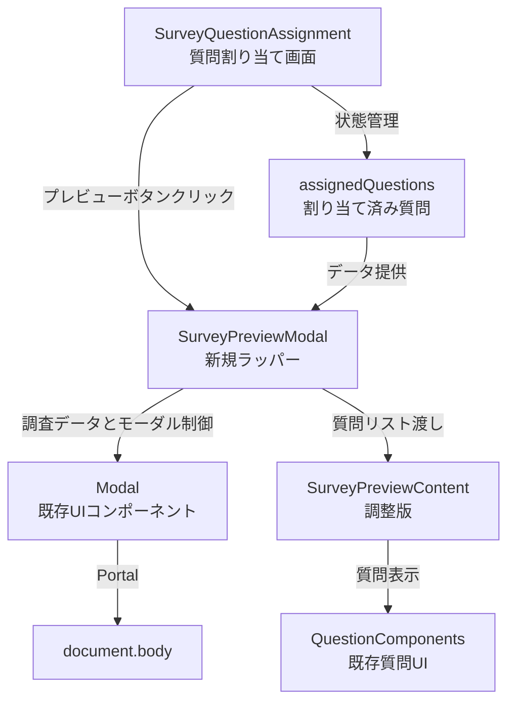
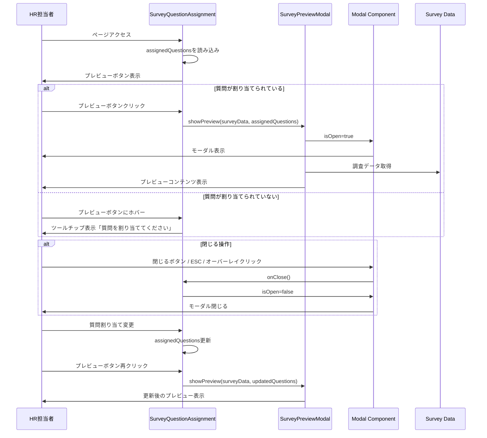

# 技術設計書

## 概要

本機能は、質問割り当て画面（SurveyQuestionAssignment）に調査プレビュー機能を追加します。HR担当者が質問の割り当て作業中に、実際の調査画面がどのように表示されるかをモーダルウィンドウでリアルタイムにプレビューできるようにします。

**目的**: HR担当者が質問割り当て中に回答者視点で調査内容を確認し、調査設計の品質を向上させる。

**対象ユーザー**: HR担当者（管理者権限を持つユーザー）

**影響範囲**: 既存のSurveyQuestionAssignmentページにプレビューボタンとモーダルUIを追加。既存のSurveyPreviewコンポーネントを再利用し、新規にSurveyPreviewModalラッパーコンポーネントを作成。

### ゴール

- HR担当者が質問割り当て作業を中断せずに調査プレビューを確認できる
- 現在割り当てられている質問の構成で、回答者が見る画面を正確に表示する
- 既存のUIパターンとコンポーネントを最大限再利用し、開発コストを最小化する
- 直感的な操作性を提供（ボタンクリック、ESCキー、オーバーレイクリックでの開閉）

### 非ゴール

- プレビューモーダル内での実際の回答入力機能（視覚的プレビューのみ）
- 質問割り当て画面の既存機能の変更や再設計
- プレビュー表示のパフォーマンス最適化（既存のSurveyPreviewコンポーネントのパフォーマンス特性を維持）
- 新しいビューモード（desktop/mobile/print以外）の追加

---

## アーキテクチャ

### 既存アーキテクチャ分析

**現在の構造**:
- `SurveyQuestionAssignment`: useState管理、ドラッグ&ドロップによる質問割り当て、フィルタリング機能
- `SurveyPreview`: 独立したページコンポーネント、AdminLayoutでラップされた調査プレビュー表示
- `Modal`: 共通UIコンポーネント、React Portal、ESC/オーバーレイクリック対応

**統合ポイント**:
- SurveyQuestionAssignmentの状態（assignedQuestions）をSurveyPreviewに渡す必要がある
- SurveyPreviewは現在ページコンポーネントとして設計されているため、モーダル内で使用するための調整が必要

**保持すべきパターン**:
- React Portalによるモーダル表示
- useStateによるローカル状態管理
- 既存のUIコンポーネント（Button, Modal, Loading）の使用
- AdminLayoutの代わりにモーダルコンテンツとして直接レンダリング

### 高レベルアーキテクチャ



**アーキテクチャ統合**:
- **既存パターン保持**: React Hooks（useState）、コンポーネント分割、UIプリミティブの再利用
- **新規コンポーネントの必要性**: SurveyPreviewはページレベルコンポーネントのため、モーダル内での使用に適したSurveyPreviewModalラッパーが必要
- **技術スタック整合性**: React 18.2、TypeScript 5.3、Tailwind CSSを継続使用
- **Steering準拠**: フロントエンド構造（components/admin/）、命名規則（PascalCase）、レイヤードアーキテクチャに準拠

### 技術整合性

本機能は既存のフロントエンド技術スタックと完全に整合します：

**使用技術**:
- **React 18.2**: 既存コンポーネントと同じフレームワーク
- **TypeScript 5.3**: 型安全性の維持
- **Tailwind CSS**: 既存のスタイリングパターンに従う
- **React Portal**: Modalコンポーネントの既存実装を活用

**新規依存関係**: なし（すべて既存の依存関係内で実装可能）

**既存パターンからの逸脱**: なし

### 重要な設計決定

#### 決定1: SurveyPreviewModalラッパーコンポーネントの作成

**決定内容**: 既存のSurveyPreviewコンポーネントを直接変更せず、モーダル表示用の新規ラッパーコンポーネントを作成する。

**背景**: SurveyPreviewは現在、AdminLayoutでラップされたページコンポーネントとして設計されており、ルーティングに依存している。モーダル内で使用するには、AdminLayoutを除外し、propsで質問データを受け取る必要がある。

**検討した代替案**:
1. **SurveyPreviewを直接変更**: 条件分岐でページモードとモーダルモードを切り替え
2. **SurveyPreviewを完全リファクタリング**: コンテンツとレイアウトを完全分離
3. **新規プレビューコンポーネント作成**: SurveyPreviewとは独立した実装

**選択したアプローチ**: ラッパーコンポーネント（SurveyPreviewModal）を作成し、既存のSurveyPreviewのロジックを部分的に再利用

**理由**:
- 既存のSurveyPreviewコンポーネントを変更せず、後方互換性を保つ
- 質問表示ロジックは新しいコンポーネントで実装し、SurveyPreviewの構造を参考にする
- モーダル特有のUI/UX要件（コンパクト表示、スクロール対応）に最適化できる
- AdminLayoutの依存を排除し、軽量なモーダルコンテンツとして実装

**トレードオフ**:
- **メリット**: 既存コンポーネントに影響なし、モーダル用に最適化可能、保守性向上
- **デメリット**: 質問表示ロジックの一部重複（ただし、共通部分は最小限）

---

## システムフロー

### ユーザーインタラクションシーケンス



---

## 要件トレーサビリティ

| 要件 | 要件概要 | 実現コンポーネント | インターフェース | フロー図 |
|------|----------|-------------------|----------------|---------|
| 1.1 | プレビューボタン表示 | PreviewButton | PreviewButtonProps | ユーザーインタラクション |
| 1.2 | ボタン有効状態制御 | PreviewButton | disabled判定ロジック | - |
| 1.3 | ボタン無効状態とツールチップ | PreviewButton | disabled + tooltip | - |
| 2.1 | プレビューモーダル表示 | SurveyPreviewModal | showPreview() | ユーザーインタラクション |
| 2.2 | SurveyPreviewコンポーネント使用 | SurveyPreviewModal | children | - |
| 2.3 | モーダル背景オーバーレイ | Modal | isOpen, onClose | - |
| 3.1-3.4 | プレビュー内容の動的反映 | SurveyPreviewModal | assignedQuestions prop | ユーザーインタラクション |
| 4.1-4.5 | プレビューモーダル操作 | Modal | closeOnEscape, closeOnOverlayClick | ユーザーインタラクション |
| 5.1-5.4 | プレビュー表示モード | SurveyPreviewModal | viewMode='employee' | - |
| 6.1-6.4 | エラーハンドリング | SurveyPreviewModal | loading, error状態 | - |

---

## コンポーネントとインターフェース

### フロントエンド / 質問割り当て画面

#### SurveyQuestionAssignment（既存コンポーネント拡張）

**責務と境界**

- **主要責務**: プレビューボタンの追加、プレビューモーダルの開閉制御、割り当て済み質問データの提供
- **ドメイン境界**: 管理者機能 / 調査運用
- **データ所有**: assignedQuestions（割り当て済み質問リスト）、surveyData（調査メタデータ）
- **トランザクション境界**: 該当なし（読み取り専用のプレビュー機能）

**依存関係**

- **インバウンド**: ユーザー操作（プレビューボタンクリック）
- **アウトバウンド**: SurveyPreviewModal（プレビュー表示）、SurveyQuestionService（質問データ取得）
- **外部**: なし

**コントラクト定義**

追加する状態とハンドラ:

```typescript
// 追加する状態
const [isPreviewOpen, setIsPreviewOpen] = useState<boolean>(false);

// プレビュー表示ハンドラ
const handleShowPreview = (): void => {
  setIsPreviewOpen(true);
};

// プレビュー閉じるハンドラ
const handleClosePreview = (): void => {
  setIsPreviewOpen(false);
};

// プレビューボタンの有効/無効判定
const canPreview = (): boolean => {
  return assignedQuestions.length > 0;
};
```

- **事前条件**: surveyDataとassignedQuestionsが読み込まれている
- **事後条件**: モーダルが開いた状態でassignedQuestionsがSurveyPreviewModalに渡される
- **不変条件**: プレビュー表示中も既存の質問割り当て機能は動作し続ける

**状態管理**

- **状態モデル**: isPreviewOpen（boolean） - プレビューモーダルの開閉状態
- **永続化**: なし（セッション内の一時状態）
- **並行制御**: なし（単一ユーザーのローカル状態）

**統合戦略**

- **変更アプローチ**: 既存コンポーネントに最小限の変更を加える（拡張）
- **後方互換性**: 既存の質問割り当て機能に影響なし
- **移行パス**: 即座に適用可能（段階的移行不要）

---

### フロントエンド / モーダルコンポーネント

#### SurveyPreviewModal（新規コンポーネント）

**責務と境界**

- **主要責務**: 調査プレビューをモーダル内で表示、質問リストのレンダリング、調査メタデータ表示
- **ドメイン境界**: 管理者機能 / 調査プレビュー
- **データ所有**: プレビュー表示用の調査データ（props経由で受け取る）
- **トランザクション境界**: 該当なし（読み取り専用）

**依存関係**

- **インバウンド**: SurveyQuestionAssignment（親コンポーネント）
- **アウトバウンド**: Modal（UIコンポーネント）、各種質問タイプコンポーネント
- **外部**: なし（すべて内部コンポーネント）

**コントラクト定義**

**コンポーネントインターフェース**:

```typescript
interface SurveyPreviewModalProps {
  /** モーダルの開閉状態 */
  isOpen: boolean;
  /** モーダルを閉じる時のコールバック */
  onClose: () => void;
  /** 調査のメタデータ */
  survey: {
    id: number;
    title: string;
    description?: string;
    start_date: string;
    end_date: string;
    is_anonymous: boolean;
  };
  /** 割り当て済みの質問リスト（order_numでソート済み） */
  assignedQuestions: SurveyQuestion[];
}

interface SurveyQuestion {
  id: number;
  text: string;
  type: QuestionType;
  category_id: number;
  category_name?: string;
  options?: string[];
  order_num: number;
  is_required: boolean;
}

type QuestionType = 
  | 'text' 
  | 'textarea' 
  | 'multiple_choice' 
  | 'checkbox' 
  | 'select' 
  | 'rating' 
  | 'rating_5' 
  | 'rating_10' 
  | 'scale' 
  | 'yes_no';
```

- **事前条件**: isOpen=trueの時、surveyとassignedQuestionsが有効なデータであること
- **事後条件**: モーダル内に調査メタデータと質問リストが表示される
- **不変条件**: プレビュー表示中は入力が無効化されており、実際の回答は不可能

**状態管理**

- **状態モデル**: ステートレス（propsからのみデータを受け取る）
- **永続化**: なし
- **並行制御**: なし

---

### フロントエンド / UIプリミティブ

#### Modal（既存コンポーネント - 変更なし）

**責務と境界**

- **主要責務**: モーダルUIの表示、オーバーレイ制御、ESCキー/オーバーレイクリック対応
- **ドメイン境界**: 共通UIコンポーネント
- **データ所有**: モーダルの開閉状態（props経由で制御）

**依存関係**

- **インバウンド**: SurveyPreviewModal
- **アウトバウンド**: React Portal（document.body）
- **外部**: なし

**コントラクト定義**

既存のModalPropsインターフェースを使用:

```typescript
interface ModalProps {
  isOpen: boolean;
  onClose: () => void;
  title?: string;
  size?: 'xs' | 'sm' | 'md' | 'lg' | 'xl';
  children: ReactNode;
  showCloseButton?: boolean;
  closeOnOverlayClick?: boolean;
  closeOnEscape?: boolean;
}
```

**使用方法**:
- **size**: 'xl'（調査プレビューは大きめの表示が必要）
- **closeOnOverlayClick**: true
- **closeOnEscape**: true
- **showCloseButton**: true

---

## データモデル

### プレビューデータ構造

本機能では新しいデータモデルの定義は不要です。既存のSurveyQuestionおよび調査メタデータ構造をそのまま使用します。

**使用する既存型**:

```typescript
// 調査メタデータ（SurveyResponseから必要な部分を抽出）
interface SurveyMetadata {
  id: number;
  title: string;
  description?: string;
  start_date: string;
  end_date: string;
  is_anonymous: boolean;
}

// 質問データ（既存のSurveyQuestion型）
interface SurveyQuestion {
  id: number;
  text: string;
  type: QuestionType;
  category_id: number;
  category_name?: string;
  options?: string[];
  order_num: number;
  is_required: boolean;
  created_at?: string;
  updated_at?: string;
}
```

**データフロー**:
1. SurveyQuestionAssignmentが`surveyData`と`assignedQuestions`を保持
2. プレビューボタンクリック時、これらをSurveyPreviewModalにpropsとして渡す
3. SurveyPreviewModalは受け取ったデータをそのまま表示に使用

**データ変換**: なし（既存のデータ構造をそのまま使用）

---

## エラーハンドリング

### エラー戦略

プレビュー機能は読み取り専用のため、重大なエラーは発生しません。主なエラーケースと対応：

### エラーカテゴリと対応

**ユーザーエラー（操作ミス）**:
- **質問未割り当て**: プレビューボタンを無効化し、ツールチップで「質問を割り当ててください」と表示
- **対応**: ボタンのdisabled属性とtitle属性で制御

**システムエラー（4xx/5xx）**:
- **調査データ取得失敗**: SurveyPreviewModal内でエラーメッセージを表示
- **対応**: Alertコンポーネントで「調査データを読み込めませんでした」と表示、「再試行」ボタンを提供

**ビジネスロジックエラー**:
- **該当なし**: プレビュー機能にビジネスロジックの検証は不要

### エラー表示

```typescript
// SurveyPreviewModal内のエラー状態管理
const [error, setError] = useState<string | null>(null);

// エラー表示UI
{error && (
  <Alert variant="danger" title="エラー">
    {error}
    <Button onClick={handleRetry}>再試行</Button>
  </Alert>
)}
```

### モニタリング

- **ログ出力**: コンソールログでエラー詳細を記録（console.error）
- **ユーザー通知**: Alertコンポーネントで視覚的にエラーを通知
- **ヘルスチェック**: 該当なし（既存のAPIヘルスチェックに依存）

---

## テスト戦略

### ユニットテスト

1. **PreviewButtonコンポーネント**:
   - プレビューボタンが正しくレンダリングされること
   - assignedQuestions.length === 0の時、ボタンがdisabledになること
   - assignedQuestions.length > 0の時、ボタンが有効になること
   - クリック時にhandleShowPreviewが呼ばれること

2. **SurveyPreviewModalコンポーネント**:
   - isOpen=trueの時、Modalが表示されること
   - isOpen=falseの時、Modalが非表示になること
   - 質問リストが正しくレンダリングされること
   - 調査メタデータ（タイトル、説明、期間）が正しく表示されること

3. **質問表示ロジック**:
   - 各質問タイプ（text, multiple_choice, rating等）が正しくレンダリングされること
   - 必須マークが正しく表示されること
   - カテゴリグループ化が正しく動作すること

### 統合テスト

1. **プレビュー表示フロー**:
   - SurveyQuestionAssignmentでプレビューボタンをクリック → SurveyPreviewModalが開くこと
   - モーダル内に割り当て済み質問が表示されること
   - 質問の順序がorder_num通りに表示されること

2. **モーダル操作フロー**:
   - 閉じるボタンをクリック → モーダルが閉じること
   - ESCキーを押す → モーダルが閉じること
   - オーバーレイをクリック → モーダルが閉じること

3. **動的更新フロー**:
   - プレビューを閉じて質問を追加 → 再度プレビューを開くと追加された質問が表示されること
   - 質問の順序を変更 → プレビューに変更後の順序が反映されること

### E2Eテスト（Playwright）

1. **プレビュー機能の基本フロー**:
   - 質問割り当て画面にアクセス
   - 質問を割り当てる
   - プレビューボタンをクリック
   - モーダルが開き、質問が表示されることを確認
   - 閉じるボタンでモーダルを閉じる

2. **エラーケース**:
   - 質問が割り当てられていない状態でプレビューボタンがdisabledであることを確認
   - ツールチップが表示されることを確認

3. **動的更新の確認**:
   - プレビューを開く → 閉じる → 質問を追加 → 再度プレビューを開く
   - 追加された質問が表示されることを確認

### パフォーマンステスト

1. **大量質問のレンダリング**:
   - 50問以上の質問が割り当てられた状態でプレビューを開く
   - モーダルが3秒以内に表示されること
   - スクロールがスムーズに動作すること

2. **モーダル開閉のレスポンス**:
   - プレビューボタンクリックから0.5秒以内にモーダルが表示されること
   - 閉じる操作から0.3秒以内にモーダルが非表示になること

---

## セキュリティ考慮事項

### 脅威モデリング

本機能はプレビュー表示のみで、データの変更や送信は行わないため、セキュリティリスクは最小限です。

**潜在的脅威**:
1. **XSS（クロスサイトスクリプティング）**: 質問テキストやオプションに悪意のあるスクリプトが含まれる可能性
2. **情報漏洩**: プレビューモーダルで表示される調査内容が意図しないユーザーに見られる可能性

### セキュリティ対策

**XSS対策**:
- Reactのデフォルトエスケープ機能を活用（{}内のテキストは自動エスケープ）
- dangerouslySetInnerHTMLは使用しない
- 質問テキストとオプションはすべてプレーンテキストとして表示

**認証・認可**:
- プレビュー機能はHR担当者（管理者）のみがアクセス可能
- 既存のProtectedRouteとAuthContextによる認証制御を継承
- モーダル表示前に認証状態を確認

**データ保護**:
- プレビューデータはメモリ上のみで保持（永続化なし）
- モーダルを閉じた後、データは破棄される
- ブラウザのLocalStorageやSessionStorageには保存しない

---

## パフォーマンスとスケーラビリティ

### 目標メトリクス

- **モーダル表示時間**: プレビューボタンクリックから1秒以内
- **質問レンダリング**: 50問の質問を3秒以内に表示
- **スクロールパフォーマンス**: 60 FPS以上の滑らかなスクロール

### スケーリングアプローチ

**現在の制約**:
- 質問数: 通常10-30問、最大100問を想定
- 同時ユーザー: HR担当者（管理者）のみ、同時アクセスは1-5名程度

**最適化戦略**:
1. **仮想スクロール**: 質問数が50問を超える場合、react-windowなどの仮想スクロールライブラリを検討（将来的な拡張）
2. **遅延レンダリング**: 初回表示時は最初の10問のみレンダリングし、スクロールに応じて追加表示
3. **メモ化**: useMemoとuseCallbackで不要な再レンダリングを防止

### キャッシング戦略

- **質問データ**: SurveyQuestionAssignmentが既に保持しているassignedQuestionsをそのまま使用（追加のAPIリクエスト不要）
- **調査メタデータ**: 同様にsurveyDataを再利用
- **画像やアセット**: 該当なし（テキストベースのプレビューのみ）

**キャッシュ無効化**: プレビューモーダルを開くたびに最新のassignedQuestionsが渡されるため、キャッシュ無効化は不要

---

## 実装チェックリスト

### 実装前の確認

- [x] 要件が明確に定義されている
- [x] 既存実装の分析が完了している
- [x] Steering文書に準拠している
- [x] アーキテクチャ図が作成されている
- [x] コンポーネント設計が完了している
- [x] データモデルが定義されている
- [x] 統合戦略が明確である

### 実装中の確認

- [ ] PreviewButtonコンポーネントの実装
- [ ] SurveyPreviewModalコンポーネントの実装
- [ ] SurveyQuestionAssignmentへのプレビュー機能統合
- [ ] 質問表示ロジックの実装
- [ ] エラーハンドリングの実装
- [ ] ユニットテストの作成
- [ ] 統合テストの作成

### 実装後の確認

- [ ] E2Eテストの実行と成功確認
- [ ] パフォーマンステストの実施
- [ ] セキュリティレビューの実施
- [ ] コードレビューの完了
- [ ] ドキュメントの更新
